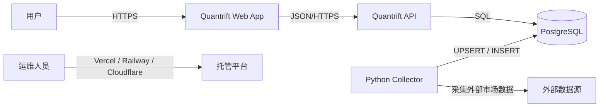
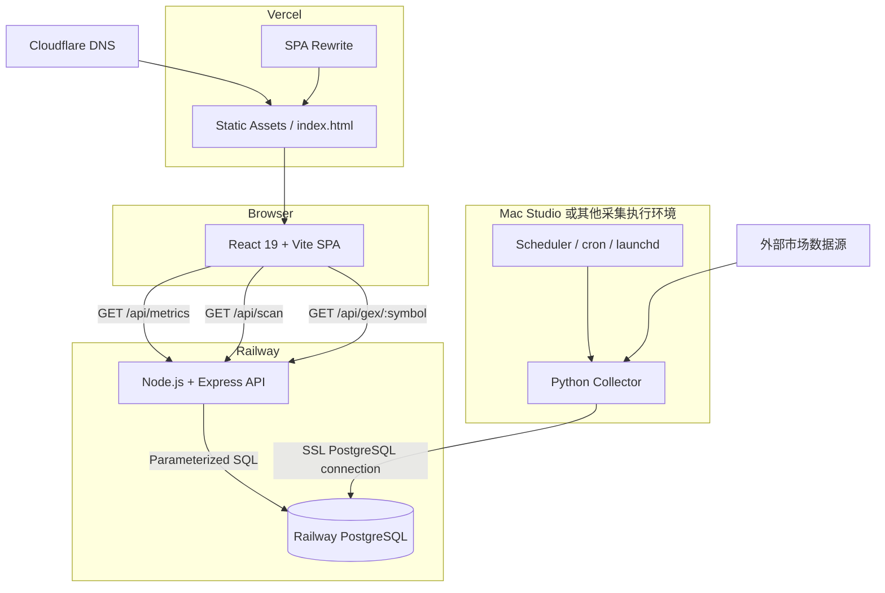
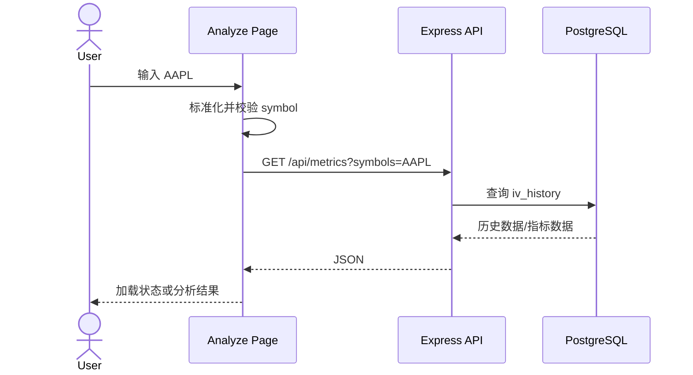
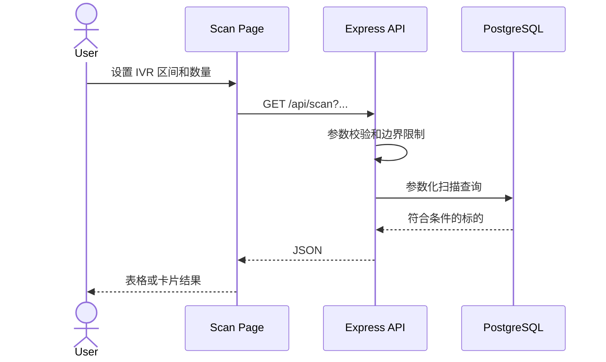
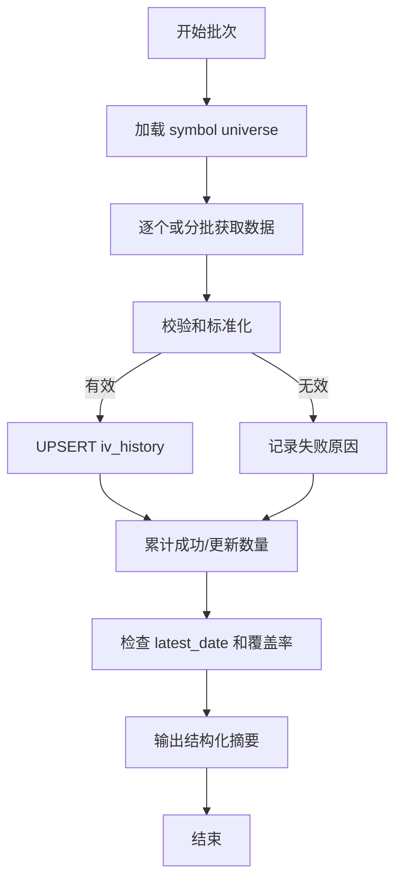

# Quantrift Options Lab 架构说明

> 项目：`whicter/quantrift_options-lab`  
> 正式站点：`https://www.quantrift.io`  
> 文档范围：前端、API、PostgreSQL、Python collector 和生产基础设施

---

## 1. 系统目标

Quantrift Options Lab 是一个面向期权研究和筛选的 Web 应用。当前系统围绕隐含波动率历史数据构建，支持：

- 按 symbol 查询指标和历史数据。
- 计算或展示 IV Rank 等波动率指标。
- 按指标区间扫描标的。
- 提供学习、分析和扫描等前端页面。
- 通过独立 collector 持续采集数据并写入 PostgreSQL。

当前架构采用清晰的三层应用加离线采集器：

```text
Presentation: React + Vite
Application/API: Node.js + Express
Persistence: PostgreSQL
Ingestion: Python collector
```

当前生产环境已完成 Vercel + Railway + Railway PostgreSQL 部署。2026-07-14 验证结果：

- `https://quantrift.io` 返回 HTTP 308，并跳转至 `https://www.quantrift.io/`。
- `https://www.quantrift.io` 返回 HTTP 200。
- Railway API `/health` 返回 `{"status":"ok"}`。
- Railway API `/api/metrics?symbols=AAPL` 能读取 `public.iv_history` 并返回 AAPL 指标。
- Railway API `/api/scan?minIvr=0&maxIvr=100&limit=5` 能返回扫描结果。
- 2026-07-15 已使用本机 IB Gateway 延迟行情完成真实 option snapshot → contracts → GEX → OI delta → scanner materialization 闭环。

## 1.1 产品数据边界

Options Lab 的目标产品能力包括 Call Wall、Put Wall、Global GEX、Local Gamma、Gamma Flip、strike-level GEX、Max Pain、PCR、IV Skew、OI concentration 和 Unusual OI delta。

这些指标依赖 option chain、open interest、volume、Greeks、IV 和 underlying price。生产系统应采用以下原则：

- 用户请求只读取 Railway API 返回的已采集/预计算快照。
- 前端 production model 不含 sample/mock seed：price、IV、GEX、Walls、结论和策略腿均只能来自各自真实 API response；字段缺失显示 unavailable。
- 普通用户输入 `AAPL` 时，不应同步触发本地 Mac Studio 或 IB Gateway 拉取 option chain。
- 当前过渡链使用 IB Gateway 与 Tastytrade adapter；IB 默认接受 delayed market data。
- GEX 计算、API response 和前端 UI 不应绑定具体 provider；应通过 provider adapter 和数据库快照隔离数据源。

建议数据流：

```text
IB / TT / future provider adapter
  → collector / ingestion job
  → option_chain_snapshots + gex_snapshots in PostgreSQL
  → Railway API
  → frontend
```

Phase 3D 当前过渡实现采用 IB Gateway internal adapter：

```text
Mac Studio IB Gateway
  → ib_option_chain_provider.py
  → option_chain_snapshots / option_contract_snapshots
  → gex_snapshots / gex_by_strike_snapshots
  → /api/gex/:symbol
  → /analyze / /scan
```

IB 过渡阶段默认范围：

| 项目 | 过渡阶段限制 |
| --- | --- |
| Symbols | 默认 `watchlist.txt`；可用 `OPTION_SYMBOLS` bounded override |
| Expirations | 默认 DTE buckets `0-14,30-60,60-90` |
| Contracts | IB 按 expiry/right 返回的实际 contracts，再按 spot 距离和 caps 过滤 |
| Rights | calls + puts |
| Source label | `ib_internal` |
| Market data type | `3`，接受 delayed data |

Provider adapter 隔离在 collector 层，API 与前端只依赖数据库 snapshot。增加或切换 provider 时，不改变 `/api/gex/:symbol`、`/api/chain/:symbol` 或前端 data contract。Adapter boundary 是 `collector/providers/base.py::OptionChainProvider`。

不建议的生产数据流：

```text
frontend user request
  → Railway API
  → local Mac Studio IB Gateway
  → synchronous option chain fetch
  → response
```

原因：延迟、IB pacing limit、Gateway session 和本地机器可用性不适合作为同步用户请求路径。

### 1.2 IB 合约身份与持久化不变量

`reqSecDefOptParams` 返回的是可用 expiration 集合与 strike 集合，不表示任意 expiration/strike/right 组合都是实际合约。正确路径是：

```text
reqSecDefOptParams
  → 选择 bounded expiration buckets
  → reqContractDetails(expiry, right, no strike)
  → IB actual contracts (conId/localSymbol/expiry/strike/right)
  → spot/cap filtering
  → reqMktData(actual contract)
  → option_chain_snapshots + option_contract_snapshots
```

硬性不变量：

- 不做 expiration × strike × right 笛卡尔积。
- `conId <= 0`、expiry/right 不匹配或关键 identity 缺失的合约不进入 snapshot。
- 同一 snapshot 按 `conId` 去重。
- delayed quote/Greeks/OI 与 live 字段进入相同规范化 contract schema。
- partial coverage 降低 completeness/confidence，但不能用推测值补字段。

## 1.2 快照缓存与新鲜度架构

真实数据源上线后，用户输入 `AAPL` 不应直接同步请求 provider。产品体验应基于“先读缓存快照、必要时后台刷新”的模式：

```text
用户请求
  → Railway API
  → PostgreSQL 最新快照
  → 若 fresh：立即返回
  → 若 stale：返回旧快照 + enqueue refresh
  → 若 missing：返回 queued/unavailable 状态 + enqueue refresh
  → collector / worker 异步刷新 provider
```

缓存层级：

| 层级 | 作用 | 建议数据 |
| --- | --- | --- |
| PostgreSQL snapshot cache | 产品事实来源 | `option_chain_snapshots`, `gex_snapshots`, `symbol_metrics_snapshots`, `scanner_results_snapshots` |
| API memory cache | 降低重复请求和 DB 压力 | metrics 30-60s, GEX 30-120s, scanner 1-5min |
| Frontend stale-while-revalidate | 保持页面稳定，不因刷新清空内容 | 保留上一份结果，后台刷新，显示 freshness 状态 |

Phase 3C implemented path：

```text
collector jobs
  → iv_history / price_history / option_chain_snapshots / gex_snapshots
  → collector/materialize_scan.py
  → scanner_results_snapshots
  → /api/scan reads latest materialized batch only
```

`/api/scan` must not rebuild the full watchlist from raw IV/GEX tables during a user request. If the materialized scanner batch is missing or stale, the API creates/reuses a `provider_fetch_jobs` row with `job_type=scanner_materialize`.

The current 67-symbol watchlist is a transitional Phase 3 data pool for controlled ingestion and verification. It is not the intended product boundary. The production scanner should use a broader universe table/materialized view with filters such as market cap, underlying price, dollar volume, optionable status, option-chain liquidity, sector/category and earnings window, while preserving the same snapshot-first request model.

Contract-level advanced filters are supported from stored snapshots only. `/api/scan` may filter for existence of at least one latest `option_contract_snapshots` row matching DTE, absolute Delta, bid/ask spread percentage, per-contract OI and per-contract volume. It must not fetch option chains synchronously during the request.

Scanner candidate selection path：

```text
scanner_results_snapshots + latest actual quoted option contracts
  -> symbol context and filters (IV / trend / GEX)
  -> server candidate engine enumerates every supported real-contract setup
  -> hard eligibility (DTE / Delta / spread / OI / volume / positive credit)
  -> score (DTE fit / Delta / spread / OI / volume / economics)
  -> final candidate DTO with exact legs, risk and breakeven
  -> browser renders DTO only
```

The default `不限` selector applies no hidden preset: it enumerates qualifying setups across the current 1-90 DTE ingestion window, including multiple rows for one symbol when strategy, expiry or strikes differ. Presets explicitly narrow DTE/Delta/liquidity. Inventory metadata such as `min_dte=2, max_dte=65` must never be presented as the recommended contract. The selector fails closed when it cannot construct a complete setup from actual same-expiry quotes; it does not synthesize contracts or show a strategy label without legs.

### Scanner Product Boundary (V3A immediate core, 2026-07-16)

`server/src/domain/scanner/candidateEngine.cjs` owns candidate enumeration, strategy-leg construction, executable-side economics, eligibility gates and score ordering. `frontend/src/lib/scanOpportunity.js` was removed: the frontend may submit selected strategy types and advanced filters, but it does not traverse raw chains or carry scoring weights.

`/api/scan` may query the latest usable quoted snapshot internally, but its normal response removes `option_contracts`. Each response row exposes scanner summary fields plus a `concrete_setup` DTO containing only the candidate strategy, display legs, expiry/DTE, economics, score and quality summary. This is a product/API boundary, not a collector or schema change. The legacy raw chain endpoint remains a separate diagnostic surface and must not be used by the Scanner page.

Vite production configuration explicitly sets `build.sourcemap=false`. Verification for commit `9fd90e9`: server tests 82/82, frontend tests 36/36, production build passed, and no `.map` file existed in `frontend/dist`.

### Materialized Candidate Batches (V3A-2, 2026-07-17)

The candidate engine can also run **ahead of** the request path so no product API needs the raw chain to produce actionable setups. `server/src/jobs/materializeScannerCandidates.js` reads the latest positioning rows plus each symbol's latest usable quoted chain, runs `buildActionableSetups` per symbol, ranks all setups globally by score, dedupes by `candidate_key` (`symbol|strategy|legs`), and writes:

```text
scanner_candidate_batches   (id, scan_key, algorithm_version, source_snapshot_cutoff,
                             universe_count, candidate_count, started_at, completed_at, status, error)
scanner_candidate_snapshots (batch_id FK, candidate_key, symbol, strategy, strategy_family,
                             expiry, dte, spot, score, rank,
                             legs_json, economics_json, signals_json, freshness_json)
```

Both tables are **additive** — they do not replace `scanner_results_snapshots`, which still carries positioning rows. `runMaterialization` writes batch(`running`) → candidate rows → batch(`completed`); on error it marks `failed`. Readers serve only `completed` batches, so a partially written run is never visible. `ALGORITHM_VERSION` (`candidate-v1`) must increase whenever enumeration/scoring/dedupe changes, so a stored batch can be told apart from one built by a different algorithm.

`GET /api/v1/scanner/candidates` serves the latest `completed` batch for a `scan_key`, returns only selected legs (never the raw chain), flags a batch older than `SCANNER_CANDIDATE_STALE_MINUTES` (default 15) as stale, and on stale/missing enqueues a `scanner_candidate_materialize` job (`__SCAN__` sentinel) without a synchronous provider fetch. `/api/scan` is intentionally **not** switched to this batch yet (rollout Step 2): this is additive and reversible. The collector materializes a batch every scan cycle through `collector/materialize_scanner_candidates.py` — a thin wrapper that shells out to `node server/src/jobs/materializeScannerCandidates.js` so the candidate engine stays one JS source rather than a drifting Python re-implementation. It is wired into `run_collector_daemon.py` and `run_railway_refresh_cycle.py` right after `materialize_scan.run()`, and degrades safely (node or `DATABASE_URL` absent → warn and skip). The Railway `python:3.11-slim` cron has no node and skips it; the node-equipped Mac Studio daemon is the runtime that writes batches (every `SCAN_MATERIALIZE_SECONDS`, default 300s). Verification: server `node --test` 148/148; collector `unittest` 194/194; migration + two real batches (81 symbols, 4768 candidates) confirmed against production Railway PostgreSQL. Remaining follow-up: the frontend cutover to `/api/v1/scanner/candidates`.

API response 应统一携带数据状态：

```json
{
  "symbol": "AAPL",
  "snapshot_ts": "2026-07-14T20:30:00.000Z",
  "source": "licensed_options_provider",
  "freshness": "fresh",
  "is_stale": false,
  "refresh_status": "none"
}
```

状态定义：

| 字段 | 可选值 | 含义 |
| --- | --- | --- |
| `freshness` | `fresh`, `stale`, `missing`, `unavailable` | 当前返回数据的新鲜度和可用性 |
| `refresh_status` | `none`, `queued`, `refreshing`, `failed` | 后台刷新任务状态 |

不同数据的刷新频率应分开定义：

| 数据类型 | 建议刷新频率 | 说明 |
| --- | --- | --- |
| IV Rank / IV30 / HV | 每日或收盘后 | 当前 Phase 3B 的主数据 |
| Earnings | 每日 | 低频元数据 |
| Option chain quote / IV / Greeks | 1-5 分钟 | 需要授权 provider；不应每次用户请求现拉 |
| Open interest | 每日或 provider 更新后 | 多数数据源非实时 |
| GEX / Walls / Gamma Flip | option chain 刷新后重新计算，1-5 分钟级 | 由快照派生 |
| Scanner results | 1-5 分钟预计算 | 不在用户请求时全市场扫描 |
| Weekly recap | 每日/每周 | 可离线生成 |

刷新请求需要 rate limit 和 budget：

- 单个 symbol refresh 至少间隔 60 秒。
- 同一用户的手动刷新需要限频。
- 全局 provider request budget 需要独立记录，避免超出供应商限制。
- `provider_fetch_jobs` 应记录 symbol、job type、status、attempts、last_error、created_at、started_at、finished_at。
- Phase 3C has the enqueue side, worker side, and provider budget accounting:
  - API creates/reuses `provider_fetch_jobs`.
  - `collector/run_refresh_worker.py` consumes queued jobs.
  - `provider_request_usage` tracks daily provider/job request counts against a configured budget.
  - `/api/admin/status/cache` reports backlog, failures, stale scanner age, empty snapshots and budget usage. It requires `ADMIN_API_TOKEN`; see 7.2.1.
  - **Budget is a runaway-loop backstop, not a cost throttle (Polygon paid = unlimited), so `PROVIDER_DAILY_BUDGET` defaults to `1_000_000`.** `reserve_budget` upserts `request_budget = EXCLUDED` on every reservation, so any process running the worker with the env unset clobbers the shared row down to the default; a low default (the old 1000) let a second runtime (`run_railway_refresh_cycle`) cap production at 1000 and starve the whole market session (2026-07-21). The default must stay far above real daily usage (~1-3k).

### 1.1 Snapshot retention

Materialized-snapshot tables are recomputed every ~5 minutes and no product reads their history (scan/alerts use only `MAX(snapshot_ts)`; weekly/unusual look back ≤5 trading days), so they are pruned by `collector/prune_snapshots.py` (hourly in the daemon, `SNAPSHOT_PRUNE_SECONDS`). Two prune roots cover the bloat via `ON DELETE CASCADE`: `option_chain_snapshots` (7d) drops its `option_contract_snapshots` / `gex_snapshots` / `gex_by_strike_snapshots` / `option_oi_delta_snapshots` children with it; `scanner_results_snapshots` (3d) is standalone. Windows are env-overridable and exceed the longest consumer look-back. Deletes are ctid-batched and per-call capped so a large first cleanup drains across cycles without a long Railway lock; best-effort, never aborts the cycle. Accumulating fact tables (`volatility_history`, `price_history`, `iv_history`) are never pruned.

---

## 2. 架构原则

### 2.1 当前原则

1. **前后端分离**  
   浏览器只访问静态前端和 HTTP API，不直接连接数据库。

2. **数据库是生产数据的单一事实源**  
   `public.iv_history` 是当前 API 使用的核心业务表。

3. **采集与查询解耦**  
   collector 负责外部数据获取和写入，API 负责只读查询和响应。

4. **平台托管优先**  
   前端使用 Vercel，API 和 PostgreSQL 使用 Railway，减少自建基础设施。

5. **单体优先，避免过早拆分**  
   当前业务规模适合一个 Express API 服务，不需要微服务。

6. **环境配置外置**  
   域名、数据库和 CORS 通过环境变量配置，不应硬编码 Secret。

### 2.2 建议补充的原则

- 所有采集写入应幂等。
- 所有 API 输入必须在服务端校验。
- schema 变更必须通过 migration。
- 关键路径应可观测。
- 架构文档区分“当前实现”和“建议演进”。

---

## 3. 系统上下文



主要参与者：

| 参与者 | 目标 |
|---|---|
| 用户 | 学习、查询 symbol、查看指标、执行扫描 |
| collector | 获取并持久化最新隐含波动率数据 |
| API | 验证请求、查询数据库、返回 JSON |
| 前端 | 提供交互、路由、输入和结果展示 |
| 运维人员 | 部署、监控、备份和故障处理 |

---

## 4. 容器级架构



---

## 5. 仓库边界

```text
quantrift_options-lab/
├── frontend/
│   ├── src/
│   ├── package.json
│   ├── vite.config.*
│   └── vercel.json
├── server/
│   ├── src/
│   │   ├── index.js
│   │   └── db.js
│   └── package.json
├── collector/
│   ├── *.py
│   └── .env.example
└── docs/
    ├── ARCHITECTURE.md
    └── QUANTRIFT_DEPLOYMENT.md
```

已确认的代码入口和配置：

- 后端生产入口：`server/src/index.js`
- 后端数据库配置：`server/src/db.js`
- 前端部署 rewrite：`frontend/vercel.json`
- API 生产启动：`npm start`
- 当前业务表：`public.iv_history`

仓库中的实际文件可能比上述示意更多。新增模块时应保持职责边界，而不是把路由、SQL、计算和响应格式全部继续堆入 `index.js`。

---

## 6. 前端架构

### 6.1 技术栈

```text
React 19
Vite
React Router
Browser Fetch / HTTP client
Vercel static hosting
```

### 6.2 页面职责

已知路由：

| 路由 | 主要职责 |
|---|---|
| `/learn` | 学习和概念内容 |
| `/analyze` | 输入 symbol 并展示指标 |
| `/scan` | 按 IV Rank 等条件筛选标的 |

建议路由层只负责页面编排，将可复用能力拆为：

```text
src/
├── pages/
├── components/
├── services/
│   └── api.*
├── hooks/
├── utils/
└── types/          # 如使用 TypeScript
```

### 6.3 API Base URL

```env
VITE_API_BASE_URL=https://quantriftoptions-lab-production.up.railway.app
```

前端不应：

- 包含数据库连接信息。
- 在浏览器中持有后端 Secret。
- 直接拼接未编码的用户输入。
- 把 Railway URL 是否可见当作安全边界。

### 6.4 前端数据流

Analyze：



Scan：



### 6.5 UI 状态

每个数据页面至少应区分：

```text
idle
loading
success
empty
error
```

不要把空数组、网络错误和无匹配结果显示成同一种状态。

### 6.6 前端错误边界

建议：

- 页面级错误提示。
- 请求 AbortController 或超时。
- 对非 2xx 响应读取统一错误结构。
- React Error Boundary 捕获渲染错误。
- 生产环境接入前端错误监控。
- 不向用户显示后端堆栈。

---

## 7. API 架构

### 7.1 技术栈

```text
Node.js
Express
pg
CORS middleware
Railway
```

### 7.2 当前接口

| Method | Path | 职责 |
|---|---|---|
| GET | `/health` | 服务存活检查 |
| GET | `/api/metrics` | 查询一个或多个 symbol 的指标 |
| GET | `/api/scan` | 按 IV Rank 等条件扫描 |
| GET | `/api/v1/scanner/candidates` | 读取最新 `completed` candidate batch（V3A-2 预物化），只出选中腿，不跑引擎、不出原始链 |
| GET | `/api/status/data` | 公开的产品安全摘要：symbol 注册表、整体 ok/degraded 与 latest_date |
| GET | `/api/admin/status/data` | 运维明细：source 分布、逐 symbol provenance、缺失/stale 标的、extra symbols |
| GET | `/api/admin/status/options` | 运维明细：option snapshot 覆盖率、completeness、provider_status |
| GET | `/api/admin/status/cache` | 运维明细：job backlog、recent failures、scanner batch age、provider budget |

### 7.2.0 生产加固边界（2026-07-17）

安全响应头有两个独立下发点，对应两种截然不同的内容：`frontend/vercel.json` 服务浏览器可执行的 SPA；`server/src/lib/securityHeaders.js` 服务只出 JSON 的 API，因此后者用 `default-src 'none'`——API 不加载任何资源，也不该出现在任何 frame 中。

CSP 目前**不含 Clerk**：未配置 `VITE_CLERK_PUBLISHABLE_KEY` 时 `ClerkProvider` 不挂载，无法对真实 Clerk 实例域名做验证。启用 Clerk 前必须扩展 `script-src`/`connect-src`/`img-src`/`worker-src`/`frame-src`，见 V3A-5 前置项。一个猜出来的 CSP 会静默打断登录，比暂时不写更糟。

CI（`.github/workflows/ci.yml`）的两个门禁都断言产物而非配置：

- `frontend/scripts/check-dist.mjs` 直接扫描 `dist/`，不信任 `vite.config.js` 的 `build.sourcemap=false`。配置与产物是两件事，只有产物是用户真正拿到的东西。
- `scripts/scan-secrets.sh` 保留 docs 在范围内并过滤占位符。Polygon key 正是通过文档进入 Git 历史的；把文档排除出扫描范围等于把已经发生过的泄露路径永久设为盲区。

内部 provider 名（`polygon_licensed` / `ib_internal` / `tt_internal`）当前不会出现在任何渲染路径：所有 `source` 字段要么写入 view model 后无人读取，要么只用于 `freshness` / `isStale` 的条件判断。`frontend/src/lib/providerDisclosure.test.js` 守住硬编码与 `DataDetails` 两条路径，但它是静态断言，不能证明运行时值不会被渲染——根治仍是服务端降级（V3A-4）。

### 7.2.1 公开状态与运维状态的边界

`/api/status/data` 是唯一公开的状态端点，因为 Scan、Weekly 和 Analyze 需要 symbol 注册表来判断一个标的是否已被收录。它只返回 `status`、`generated_at`、`latest_date`、`expected_count`、`expected_symbols` 和 `universe.scan_enabled_count`。

运维明细一律走 `/api/admin/status/*`，需要 `ADMIN_API_TOKEN`。两侧共用 `server/src/domain/status/statusReports.js` 的同一组 builder；`toPublicDataStatus()` 是把任何内容降级给未认证客户端的唯一通道，它会移除：

- `source_counts` 与逐 symbol `source`：这些会泄露 `polygon_licensed`、`ib_internal`、`tt_internal` 等内部 provider 名，与 V3A-4 的 provider 降级展示要求一致。
- `missing_symbols` / `stale_symbols` / `price_history` 覆盖明细：属于采集健康度，不是产品数据。
- `extra_symbols`：泄露 watchlist 之外的内部采集范围。

`requireAdminToken` 对未配置 `ADMIN_API_TOKEN` 的部署返回 503 而不是放行——缺失的密钥必须关闭端点，不能打开它。token 比较使用 `crypto.timingSafeEqual`，接受 `Authorization: Bearer` 或 `X-Admin-Token`。

`GET /api/heartbeat/status` 同样是运维读模型，因此也需要 admin token；`POST /api/heartbeat` 继续使用 collector 自己的 `HEARTBEAT_TOKEN`，两者是不同的密钥和不同的调用方。

### 7.3 建议分层

当前入口为 `server/src/index.js`。随着功能增长，建议演进为：

```text
server/src/
├── index.js              # 进程启动
├── app.js                # Express app 构建
├── config/
│   └── env.js
├── db/
│   ├── pool.js
│   └── queries/
├── routes/
│   ├── health.js
│   ├── metrics.js
│   └── scan.js
├── controllers/
├── services/
├── validators/
├── middleware/
│   ├── errors.js
│   ├── requestId.js
│   └── rateLimit.js
└── utils/
```

职责：

```text
route
  → validator
  → controller
  → service
  → repository/query
  → PostgreSQL
```

对于当前小规模项目，可以逐步拆分，不必一次性引入复杂框架。

### 7.4 参数校验

`/api/metrics`：

- `symbols` 必填。
- 去除空白并统一大写。
- 限制 symbol 数量。
- 限制单个 symbol 长度。
- 仅允许预期字符集合。
- 拒绝空 symbol。

`/api/scan`：

- `minIvr` 和 `maxIvr` 为有限数字。
- 推荐范围为 0–100。
- `minIvr <= maxIvr`。
- `limit` 为正整数。
- 服务端设置最大 `limit`。
- 对未知参数可以忽略或明确拒绝，但行为需一致。

### 7.5 SQL 安全

必须使用参数化 SQL：

```js
await pool.query(
  'SELECT * FROM public.iv_history WHERE symbol = $1 ORDER BY date DESC',
  [symbol]
);
```

不得：

```js
const sql = `SELECT * FROM iv_history WHERE symbol = '${symbol}'`;
```

即使前端做过校验，后端仍必须参数化。

### 7.6 统一响应

建议成功响应：

```json
{
  "data": {},
  "meta": {
    "requestId": "..."
  }
}
```

建议错误响应：

```json
{
  "error": {
    "code": "INVALID_QUERY",
    "message": "minIvr must be between 0 and 100"
  },
  "meta": {
    "requestId": "..."
  }
}
```

当前接口不必立刻破坏兼容性，但新增接口应逐步统一。

### 7.7 连接池

API 使用 PostgreSQL 连接池，而不是每次请求创建全新连接。

建议配置：

- 连接超时。
- 查询超时。
- 合理 `max` 连接数。
- 监听 pool error。
- Railway 关停时优雅关闭连接池。

### 7.8 Health、Readiness 和 Liveness

当前：

```text
GET /health
```

建议未来区分：

| Endpoint | 作用 |
|---|---|
| `/health` 或 `/live` | 进程是否存活 |
| `/ready` | API 是否能够服务，包括数据库连接 |
| `/version` | 可选，返回 commit/version，不含 Secret |

---

## 8. 数据层架构

### 8.1 核心表

```text
public.iv_history
```

语义上，该表保存按 symbol 和交易日期组织的隐含波动率历史及相关字段。

价格 OHLCV 存入：

```text
public.price_history
public.price_history_30m
```

日线表用于趋势图、RVol、weekly recap、HV 和后续技术指标；30M 表用于 breakout 与盘中结构。`collect_prices.py` 每天按 watchlist 原子 upsert 两个 timeframe，API 只读查询最近窗口。

当前状态：

- `server/src/migrate.js` 已包含两张 price history 表及索引。
- 2026-07-14 已在 Railway PostgreSQL 创建 `public.price_history`。
- `collector/collect_prices.py` 默认 `PRICE_PROVIDER=polygon`；日线 400 bars、30M 35 calendar days，source=`polygon_licensed`。IB 与 Stooq 仅为显式 fallback。
- **可靠性（P4，2026-07-23）**：cron 每工作日跑两次 `35 13,18 * * 1-5`——13:35 PT（收盘后 35 分钟，当日 EOD 可能未 finalize）与 18:35 PT（=21:35 ET，过 settle）。每次重取 400 天并 upsert，故第二次运行自愈第一次的缺口，当日 finalize 的 bar 同日补上（修此前"周五缺到周一"）。运行末尾 `check_price_freshness` 用纯函数 `settled_market_date`（按 ET settle 小时 `PRICE_EOD_SETTLE_HOUR_ET`=20 判定该有哪根 bar，周末回退周五，holiday 未建模）对比 DB 最新 bar，落后即 WARNING——只观测、绝不 fail run。可复现：`docs/validation/DAILY_PRICE_CRON_RELIABILITY_2026-07-23.md`。
- `server/src/routes/prices.js` 暴露 `GET /api/prices/:symbol?limit=60&interval=day|30m`。
- 前端 `/analyze` Tab2 和 `/weekly` Sec1 会优先使用 `price_history`，没有价格历史时保留清晰 fallback/提示。
- yfinance 不作为默认路径；后续如接入订阅价格源，应新增 provider adapter，不改变前端 API contract。

具体列定义必须以生产数据库和 migration 为准；在 schema 未纳入代码前，不应仅凭文档猜测字段。

### 8.2 建议数据不变量

以下约束适合 IV 历史表，但实施前需与实际数据源验证：

- `symbol` 非空。
- `date` 非空。
- 同一 `symbol + date` 不重复。
- IV 数值为有限非负值。
- 派生字段能够由原始字段和历史窗口重算。
- 采集时间与市场数据日期分开记录。
- 可识别数据来源或 collector 版本。

建议：

```text
UNIQUE(symbol, date)
INDEX(symbol, date DESC)
INDEX(date DESC)
```

### 8.3 IV Rank 语义

常见定义：

\[
\mathrm{IVRank}
=
\frac{\mathrm{IV}_{current}-\mathrm{IV}_{min}}
{\mathrm{IV}_{max}-\mathrm{IV}_{min}}
\times 100
\]

其中窗口常设为约一年交易日，但项目应明确：

- 使用多少个交易日。
- 使用哪一种 IV。
- 当前值对应哪个时间点。
- 窗口不足时如何处理。
- 当最大值等于最小值时如何处理。
- 是否在 SQL、API 或 collector 中计算。

避免不同页面或接口采用不同口径。

**前向口径统一（Phase 3，2026-07-23）**：`volatility_history` 的 252 天序列由历史回填段与前向每日段拼接而成，两段必须同口径,否则拼接点的人为 IV 跳变会污染 IV Rank（对序列噪声敏感的相对指标）。历史回填 (`polygon_backfill_bs`) 用 constant-30-day（ATM call+put、总方差插值、BS 反解）；前向此前用浮动 30–45 DTE 单张 ATM **call**（`polygon_derived`），两处方法不一致。现前向改为 `derive_volatility.fetch_cm30_observations` + `implied_vol.constant_maturity_atm_iv`：取每快照每 bracketing 到期的 ATM strike call+put **快照 IV**（Polygon snapshot 自带 IV，无需 BS 反解），按总方差插值到 30 天，写 `iv_source='polygon_snapshot_cm30'`。`iv_source` 三态区分方法来源（`polygon_backfill_bs`/`polygon_snapshot_cm30`/弃用的 `polygon_derived`）。env `IV_CM30_ENABLED`（默认 true）。可复现：`docs/validation/IV_CM30_FORWARD_UNIFICATION_2026-07-23.md`。

### 8.4 派生指标放在哪里

可选方案：

| 位置 | 优点 | 缺点 |
|---|---|---|
| 查询时 SQL 计算 | 单一数据源，实时 | 大扫描可能昂贵 |
| API 服务计算 | 易测试和演进 | 传输数据较多 |
| collector 预计算 | 查询最快 | 口径升级需回填 |
| Materialized View | 查询快、逻辑集中 | 需刷新机制 |

当前规模可继续查询时计算；若 `/api/scan` 延迟显著，再考虑预计算或 materialized view。

### 8.5 Migration

建议：

```text
server/migrations/
├── 001_create_iv_history.sql
├── 002_add_iv_history_indexes.sql
└── ...
```

migration 是 schema 的事实源，文档只解释设计。

---

## 9. Collector 架构

### 9.1 职责

collector 负责：

1. 从外部数据源获取期权或隐含波动率数据。
2. 标准化 symbol、日期和数值。
3. 校验完整性。
4. 计算必要派生字段，若该职责由 collector 承担。
5. 幂等写入 PostgreSQL。
6. 记录运行结果。
7. 暴露失败和数据新鲜度信号。

### 9.2 推荐执行流程



### 9.3 幂等写入

建议使用：

```sql
INSERT INTO public.iv_history (...)
VALUES (...)
ON CONFLICT (symbol, date)
DO UPDATE SET ...;
```

更新策略要明确：

- 数据源修订时是否覆盖。
- 哪些字段允许更新。
- 是否记录 `updated_at`。
- 如何防止空值覆盖已有有效值。

### 9.4 失败隔离

collector 不应因单个 symbol 失败而完全丢失整个批次。建议：

- 对外部请求有限次数重试。
- 指数退避。
- 连接和读取超时。
- 单 symbol 错误记录。
- 最终汇总失败列表。
- 失败比例超过阈值时触发告警。
- 数据库事务粒度避免整个 universe 一次性大事务。

### 9.5 调度

当前 Mac Studio 使用 PM2 直接执行本仓库，不复制 runtime：

```text
collector/ecosystem.config.cjs
  ├── quantrift-options-collector
  │   └── run_collector_daemon.py
  │       ├── option refresh scheduler (300s, batch 2)
  │       ├── refresh worker (60s)
  │       └── scanner materialization (300s)
  └── quantrift-options-prices
      └── collect_prices.py (Mon-Fri 13:35 & 18:35 PT)
```

启动与持久化：`pm2 start collector/ecosystem.config.cjs && pm2 save`。旧 LaunchAgent、wrapper 和 `~/.quantrift_options_collector` 已移除。

运行保障：

- 机器断电恢复后任务能继续：2026-07-16 `pmset -g custom` 已验证 AC Power `autorestart 1`；LaunchAgent `pm2.congrenhan` 使用 `RunAtLoad=true` 执行 `pm2 resurrect`，且 saved process list 含五个 Quantrift collector apps。系统在市电恢复后会启动并恢复已保存的 PM2 apps。
- 网络失败可恢复。
- 日志可查看。
- 运行状态可告警。
- Secret 安全存放。

UPS 采购和实际断电/复电演练尚未完成。验收不能只看 `autorestart` 设置，还需验证 Mac、IB Gateway 和 PM2 collector 在一次受控断电后恢复，并检查 job 队列与最新快照没有丢失。

---

## 10. 端到端数据流（Phase 3F 现状）

### 10.1 前端数据需求（Analyze 页面）

| 数据 | 用途 | API 端点 |
|---|---|---|
| IV/HV metrics | Tab1 IV Rank、IV-HV diff | `GET /api/metrics?symbols=` |
| Price history | Tab2 趋势图、RVol | `GET /api/prices/:symbol` |
| GEX snapshot | Tab1 Call Wall / Put Wall / GEX 图 | `GET /api/gex/:symbol` |
| Unusual OI | Tab3 期权大单异动 | `GET /api/unusual/:symbol` |
| Sweep / Dark Pool | Tab3 实时资金流 | `GET /api/flow/:symbol` |
| Composite Momentum | Tab2 多周期动量 | `GET /api/sr/:symbol` (`momentum`) |

### 10.2 写路径（采集 → 数据库）

**IV / HV metrics**
```text
Tastytrade API  GET /market-metrics?symbols=...
  → collect.py（每日 4:30pm ET，全量 watchlist，batch 50）
  → iv_history
      symbol, date, iv30, hv30, hv60, hv90,
      iv_rank, iv_percentile, iv_hv_diff,
      earnings_date, term_structure
```

**Price history（日线 OHLCV）**
```text
IB Gateway API  reqHistoricalData（daily OHLCV）
  → collect_prices.py（PM2 cron，Mon-Fri 13:35 & 18:35 PT）
  → price_history
      symbol, date, open, high, low, close, volume
```

**Option chain snapshot**
```text
Polygon.io  GET /v3/snapshot/options/{symbol}?limit=250  （+ next_url 分页）
  + GET /v2/aggs/ticker/{symbol}/prev  （underlying 前日 OHLCV）
  → polygon_option_chain_provider.py
  → run_refresh_worker.py（worker daemon，60s poll）
      ← schedule_option_refresh.py（scheduler，每 300s，填满至 queue target 20，max_age 60min；常规交易时 `require_quotes=true`）
      → 无有效 bid/ask 时回退 IB Gateway（`ib_internal`，实时类型 1）
  → option_chain_snapshots
      symbol, snapshot_ts, source, underlying_price,
      contract_count, completeness_pct, missing_greeks_ratio, missing_oi_ratio
  → option_contract_snapshots
      snapshot_id, expiry, strike, option_right,
      bid, ask, last, mark, volume, open_interest,
      iv, delta, gamma, theta, vega, rho
```

**GEX / Walls（派生，无外部 API）**
```text
option_chain_snapshots + option_contract_snapshots
  → compute_gex.py（由 daemon 在 option chain 写入后触发）
  → gex_snapshots
      snapshot_id, symbol, global_gex, local_gamma, gamma_flip,
      gamma_regime, call_wall, put_wall, max_pain, pcr_oi, pcr_volume,
      confidence, gamma_curve
  → gex_by_strike_snapshots
      snapshot_id, strike, call_gex, put_gex, net_gex,
      call_oi, put_oi, call_volume, put_volume
```

**Scanner（派生，无外部 API）**
```text
iv_history + gex_snapshots + option_contract_snapshots + price_history
  → materialize_scan.py（每 300s；worker batch 内每轮只执行一次）
  → scanner_results_snapshots
      symbol, snapshot_ts, scan_key, iv_rank, iv_hv_diff,
      trend_score, trend_label, gex_regime, signal_score, ...
```

**OI Delta / Unusual（派生，无外部 API）**
```text
option_contract_snapshots（最新 snapshot vs 同一来源的前一纽约交易日 snapshot 比较）
  → materialize_oi_delta.py（worker batch 内每轮只执行一次）
  → option_oi_delta_snapshots
      symbol, snapshot_ts, strike, expiry, option_right,
      oi_delta, is_unusual, status
```

**Ingestion / derivation 边界（E3，2026-07-17）**

派生成本按作用域分两类，worker 按此调度：

- **Per-symbol**：`compute_gex.py` 只读刚写入的那个 snapshot，成本随 symbol 线性增长，因此在 option snapshot 落库后立即执行。
- **Global**：`materialize_oi_delta.py` 与 `materialize_scan.py` 读全部 symbol，成本与"谁触发了它"无关。一个 batch 里 N 个 option job 各跑一次会把全局 scanner 重算 N 次，因此 job 只在 `PendingDerivations` 记录"我 invalidate 了什么"，`run_pending_derivations` 在 batch 末尾各执行一次。

`scanner_materialize` job 因此不再 inline 执行：job row 保持 `running`，直到 batch 末尾的真实结果回写 `succeeded` 或 `failed`。这是刻意的——延迟执行不能让失败的物化被记成成功。两个全局派生各自独立 try/except，OI delta 失败不阻断 scanner 物化。

**`symbol_data_state`：每 symbol × product 的读侧汇总（E4，2026-07-17）**

```text
run_refresh_worker.handle_job
  → job_product_facts()（job 语义 → per-product 事实）
  → symbol_data_state.record_products()
  → symbol_data_state (symbol, product) 一行
      latest_snapshot_ts, latest_market_date, source,
      refresh_status, last_job_id, last_error_code, updated_at
```

设计约束：

- **不存 freshness。** freshness 随 wall-clock 衰减：60 分钟目标的行在第 61 分钟没有任何写入也已经过期，存下来的标签必然说谎。表只记录"什么落库了、什么时候、来自哪里、上次尝试做了什么"；freshness 由读方用 `latest_snapshot_ts` + product policy 现算。
- **product 独立。** `price_daily` / `price_30m` / `metrics` / `option_chain` / `gex` 各自一行。期权链落库但 GEX 未过质量门是常态（2026-07-17 GDXJ 实例），塌缩成单一 per-symbol 状态会谎报 GEX 可用。
- **失败不擦除数据。** upsert 用 `COALESCE` 保留上一次真实 snapshot；失败只更新 `refresh_status` / `last_error_code`，数据仍可作为 stale 展示。
- **错误码是粗粒度码，不是原始消息。** provider 名和请求明细不进该表，留在 `provider_fetch_jobs.last_error` 给运维。
- **写入 best-effort。** snapshot 表仍是 source of truth；汇总表写失败不能把成功的刷新变成失败的 job。

**Shared provider rate limiter（E7，2026-07-17）**

`provider_rate_limits(provider, scope, next_allowed_at, last_status, updated_at)` 是跨进程/跨机器的 provider 限流状态。它替代的 file lock 只能约束同一文件系统上的进程：一旦 Mac Studio 与 Railway collector 同时跑，两边各自持有自己的锁文件，实际速率翻倍。

```text
DatabaseRequestPacer.wait()
  → INSERT ... ON CONFLICT DO UPDATE
      SET next_allowed_at = GREATEST(next_allowed_at, NOW()) + delay
      RETURNING next_allowed_at - delay - NOW()   ← 我的 slot 还有多久
  → commit + close                                ← 不持锁睡眠
  → sleep(该时长)
```

- **slot 认领是原子的。** 两个 worker 竞争拿到两个不同的 slot，不可能撞在同一时刻。
- **数据库时钟是唯一权威。** 等待时长在 SQL 内算，系统时钟有偏差的两台机器不会都认为轮到自己。
- **429 惩罚必须共享。** 本地 `time.sleep` 只暂停一个进程，其余继续猛打——这正是单次拒绝变成风暴的机制。`penalize()` 推移共享 slot；`GREATEST` 保证并发 429 中较短的 `Retry-After` 不缩短已生效的较长退避。
- **降级是显式的。** 无 `DATABASE_URL` 时退回 file lock 并 warn，绝不静默发出不受限请求。

**Queue-fill scheduler（E6，2026-07-17）**

`schedule_option_refresh.py` 按**队列深度**补满，而不是每轮固定入队 N 个：

```text
symbol_universe (active)          ← 不是 watchlist.txt；后者只是 seed
  → assign_tiers()                ← core / recent_active / universe_scan / cold_backfill
  → load_queue_depth()            ← 含 on-demand job，共用同一 provider 预算
  → fill_count(depth) = min(target - depth, max_per_cycle)
  → select_candidates()           ← tier 优先，tier 内 missing 优先、最旧优先
  → provider_fetch_jobs (request_params.priority)
```

- **深度是约束量。** per-cycle cap 只限制被抽干的队列回填速度。原先 2 个/300s 而 worker 2 个/60s，worker 约 80% 时间空转。
- **后台 tier 永远低于 on-demand 的 100。** worker 按 `priority DESC` claim；后台扫描若与之持平，正在等页面的用户会排到冷补齐后面。
- **tier 表示"谁需要"，不表示"多旧"。** staleness 只在 tier 内排序，不跨 tier 提升。
- **staleness 的判定不能叠加"是否带报价"（2026-07-19 修复）。** `load_refresh_state` 早先把"最新快照"限定为带有效 bid/ask 的那条，导致从未成功拿到报价的标的（含永久失败的 `VIX`——它是指数，走股票 `/prev` 端点必然报错）在排序里永远显示"从未采集"，比任何真实但较旧的快照都靠前；每 30 分钟冷却期一到就重新抢占大半队列容量，把 STX/SRVR 等曾经成功、只是较旧的标的饿了 20+ 小时。现在 `latest_snapshots` 只看**任意**快照的时间戳；报价需求已由独立的 `require_quotes`（仅常规交易时段为真）承担，排序不必重复这个门槛。`VIX` 已从 `scan_enabled` 移出。详见 `docs/validation/SCHEDULER_STARVATION_FIX_2026-07-19.md`。
- **候选来自 universe。** universe 会因用户分析未知 symbol 而增长（实测 80 vs watchlist 67）；读文件会把 on-demand symbol 永久排除在后台刷新之外。

**Freshness 契约（E5，2026-07-17）**

`server/src/domain/status/freshness.js` 是全部数据产品唯一的 freshness 定义。此前四个 route 各写各的规则（`prices.js` 5 天、`metrics.js` 2 天、`options.js` 180 分钟、`market.js` 30M 自有规则），E5 将其收敛为一处。新增阈值必须加到该模块，不得在 route 内重新推导。

| Product | 判据 | 理由 |
|---|---|---|
| `price_daily` | market date + 多天容差 | 周末/假日没有 bar 可产生，上一交易日收盘仍然当前；容差用来吸收非交易日 |
| `price_30m` | 与最新日线 market date 比较 | 落后日线的 30M 属于上一 session，不能当作当前确认（沿用 P1.4 规则） |
| `metrics` | market date，交易日级别 | 每个 session 收盘后落一次 |
| `option_chain` | 时钟 age | 盘中产品 |
| `gex` | 继承其 option snapshot 的时间 | GEX 无独立 freshness |

两条不变量：

- **freshness 现算，不落库。** 它随 wall-clock 衰减，存下来的标签在没有任何写入时也会过期。`symbol_data_state` 记录事实，本模块给判定。
- **真实数据优先于 refresh 状态。** stale + failed refresh 报 `stale`——用户仍看得到真实数据，报 `failed` 会暗示空白页。`queued`/`failed` 只用于"没有可展示的数据"。

`GET /api/analyze/:symbol` 的 `products` 字段按此逐 product 返回 `state` / `freshness` / `is_stale` / `age_minutes` / `age_days` / `refresh_status`。`option_quotes` 是独立 product：链已落库但无可用 bid/ask 是常态，按链的 freshness 报 quotes 会谎报策略腿可用。

### 10.3 读路径（API → 前端）

```text
用户输入 symbol
  → api.js 标准化 + 校验 symbol
  → Express API routes（in-memory cache 检查）
      /api/metrics    → iv_history（最新日期）                    cache 60s
      /api/prices     → price_history（最近 N 天）                无 cache
      /api/gex        → gex_snapshots JOIN option_chain_snapshots  cache 120s
      /api/unusual    → option_oi_delta_snapshots（最新 snapshot） cache 60s
      /api/scan       → scanner_results_snapshots（latest batch）  cache 60s
  → JSON response 携带 freshness 元数据
      { freshness, is_stale, age_minutes, refresh_status }
  → 前端 analyzeData.js 判断是否显示 stale notice
```

### 10.4 新鲜度判定参数

| 数据 | 判定方式 | 阈值（server env var） |
|---|---|---|
| GEX / option snapshot | `snapshot_ts` vs `now` | `OPTIONS_STALE_MINUTES=180` |
| Scanner | `snapshot_ts` vs `now` | `SCANNER_STALE_MINUTES=5` |
| IV Rank（iv_history） | `date` vs today | `IV_STALE_DAYS=2` |

option daemon 全周期约 2.8h（67 symbols ÷ 2/batch × 5min），OPTIONS_STALE_MINUTES=180 与此匹配。

### 10.5 部署路径

```text
GitHub master
  ├── frontend/ 变更 → Vercel Build → Vercel Production
  └── server/ 变更   → Railway Build → Railway API

collector 更新
  └── rsync 到 Mac Studio → pm2 reload ecosystem.config.cjs --update-env
```

---

## 11. 基础设施架构

### 11.1 Cloudflare

职责：

- 域名注册或 DNS 管理。
- 将 `@` 和 `www` 指向 Vercel。
- 当前不代理主站流量。

### 11.2 Vercel

职责：

- 构建 Vite。
- 托管静态资源。
- TLS。
- CDN。
- SPA rewrite。
- Production/Preview 部署。

### 11.3 Railway API

职责：

- 构建和运行 Express。
- 注入 `PORT`。
- 管理 API 环境变量。
- 提供公网 HTTPS 域名。
- 健康检查和日志。

### 11.4 Railway PostgreSQL

职责：

- 持久化 `iv_history`。
- 为 Railway API 提供私有网络连接。
- 为本地 collector 提供受保护的公网 TCP 连接。
- 提供平台级存储、指标和可选备份能力。

---

## 12. 环境边界

| 环境 | 前端 | API | 数据库 |
|---|---|---|---|
| Local full stack | localhost:5173 | localhost:3001 | Railway 公网 DB 或本地 DB |
| Local frontend only | localhost:5173 | Railway API | Railway DB，仅临时调试 |
| Vercel Preview | Preview URL | 明确配置的 API | 对应 DB |
| Production | www.quantrift.io | Railway Production | Railway Production DB |

风险：

- Preview 不应无意间写生产数据。
- 本地 UI preview 默认应调用本地 backend；直接调用 Railway production API 只作为临时调试路径。
- collector 测试不应污染生产 `iv_history`。
- 若只有一个数据库，应把所有 API 保持只读，并谨慎运行 collector。
- 长期建议增加 staging 数据库或至少独立 schema。

---

## 13. 安全架构

### 13.1 信任边界

```text
不可信：
- 浏览器输入
- URL query parameters
- 外部数据源响应
- 公网 API 请求

可信但需最小权限：
- Railway API runtime
- collector runtime
- PostgreSQL credentials
- Vercel/Railway deployment integration
```

### 13.2 必要控制

- 后端参数校验。
- 参数化 SQL。
- CORS allowlist。
- API rate limit。
- 响应大小限制。
- 查询 timeout。
- 数据库连接池限制。
- Secret 不进入前端。
- 日志脱敏。
- 依赖漏洞扫描。
- 平台账户 MFA。
- GitHub branch protection，按项目成熟度逐步启用。

### 13.3 数据库权限

长期建议区分：

```text
quantrift_api
- SELECT iv_history

quantrift_collector
- SELECT/INSERT/UPDATE iv_history

quantrift_migration
- DDL 权限，仅用于 migration
```

当前若统一使用高权限账户，应视为技术债。

---

## 14. 性能架构

### 14.1 当前瓶颈候选

- `/api/scan` 对整个历史表重复聚合。
- 缺少 `symbol/date` 索引。
- 每个 symbol 多次独立查询。
- API 返回过量历史数据。
- Railway 连接数或资源限制。
- 前端重复请求。
- collector 与扫描同时进行导致数据库竞争。

### 14.2 优化顺序

1. 记录真实查询延迟。
2. 使用 `EXPLAIN (ANALYZE, BUFFERS)`。
3. 增加正确索引。
4. 减少返回字段和行数。
5. 合并 N+1 查询。
6. 在 API 层做短期缓存。
7. 必要时增加预计算表或 materialized view。
8. 最后再考虑 Redis 或服务拆分。

不要在没有数据的情况下先引入缓存基础设施。

---

## 15. 可靠性架构

### 15.1 主要故障模式

| 故障 | 用户影响 | 检测 |
|---|---|---|
| Vercel 构建失败 | 新版本不上线 | Vercel deploy status |
| SPA rewrite 丢失 | 深层路由刷新 404 | 路由 smoke test |
| Railway API 挂掉 | Analyze/Scan 不可用 | `/health` |
| PostgreSQL 不可用 | API 500 | readiness/DB error |
| collector 未运行 | 数据陈旧 | `MAX(date)` |
| collector 部分失败 | 标的覆盖下降 | symbol count/失败率 |
| CORS 配错 | 浏览器请求失败 | DevTools/自动化请求 |
| schema 漂移 | 查询失败 | migration/version check |

### 15.2 恢复目标

当前项目可以采用轻量目标，后续明确：

- RTO：服务故障后允许多长时间恢复。
- RPO：最多允许丢失多少采集数据。
- 数据能否从外部源重新回填。
- PostgreSQL 恢复是否经过演练。

### 15.3 降级策略

- `/learn` 应尽量不依赖 API。
- Analyze 请求失败时显示明确错误，不显示错误数据。
- Scan 超时时返回可理解的错误。
- 不应在数据库错误时静默返回空数组。
- collector 数据陈旧时，前端可显示“数据截至日期”。

---

## 16. 可观测性架构

### 16.1 API

记录：

```text
timestamp
level
requestId
method
path
status
durationMs
errorCode
```

避免记录：

```text
DATABASE_URL
password
Authorization token
完整堆栈直接返回用户
```

### 16.2 Collector

记录：

```text
runId
startedAt
finishedAt
source
symbolsRequested
symbolsSucceeded
symbolsFailed
rowsInserted
rowsUpdated
latestDataDate
```

### 16.3 数据质量

建议指标：

```text
latest_date
distinct_symbol_count
rows_per_date
duplicate symbol/date count
null critical field count
collector failure ratio
```

### 16.4 告警

最有价值的第一批告警：

1. API `/health` 连续失败。
2. HTTP 5xx 突增。
3. collector 运行失败。
4. `latest_date` 落后于预期交易日。
5. symbol coverage 显著下降。
6. PostgreSQL 存储或连接接近上限。

---

## 17. 测试架构

### 17.1 前端

- API service 单元测试。
- 页面 loading/error/empty 状态。
- 路由直接访问测试。
- Analyze 和 Scan 的核心交互测试。

### 17.2 API

- 参数校验。
- metrics 成功/空结果/非法 symbol。
- scan 边界值。
- 数据库异常映射。
- SQL 注入输入。
- CORS。
- 最大 limit。

### 17.3 Collector

- 外部响应解析。
- 缺失字段。
- 非法数值。
- 重试。
- 幂等写入。
- 部分失败。
- 数据日期和时区。

### 17.4 端到端

最小 smoke tests：

```text
GET /
GET /learn
GET /analyze
GET /scan
GET /health
GET /api/metrics?symbols=AAPL
GET /api/scan?minIvr=0&maxIvr=100&limit=5
```

---

## 18. 架构决策记录

建议在：

```text
docs/adr/
```

保存重要决策。

首批 ADR：

```text
0001-use-vercel-for-frontend.md
0002-use-railway-for-api-and-postgres.md
0003-keep-collector-separate-from-query-api.md
0004-use-www-as-canonical-domain.md
0005-use-postgresql-as-system-of-record.md
```

ADR 应写明：

- 背景。
- 决策。
- 替代方案。
- 影响。
- 状态。

---

## 19. 当前技术债

按优先级：

### P0：数据可信度

- 确认 collector 持续运行。
- 增加数据新鲜度检查。
- 明确 IV Rank 计算口径。
- 防止 symbol/date 重复。

### P1：可恢复性

- 将 schema 纳入 migration。
- 明确备份策略。
- 执行一次恢复演练。
- 保存 collector 运行摘要。

### P1：API 防护

- 完整参数校验。
- 服务端最大 limit。
- rate limit。
- 查询 timeout。
- 统一错误处理。

### P2：代码可维护性

- 从 `index.js` 拆出 routes、services 和 queries。
- 集中环境变量校验。
- 增加自动测试。
- 统一 API 响应结构。

### P2：可观测性

- 结构化日志。
- request ID。
- Sentry 或同类错误监控。
- 数据质量 dashboard。

---

## 20. 演进路线

### 阶段 1：稳定当前单体

```text
React SPA
Express API
PostgreSQL
Mac Studio collector
```

完成：

- migration。
- backup。
- health/readiness。
- 数据新鲜度告警。
- 参数校验。
- 索引和慢查询分析。

### 阶段 2：提升数据管道

当 symbol 数量或采集频率增长时：

- collector 批处理。
- 任务锁，防止并发重复运行。
- run history 表。
- failed symbol 重试队列。
- 数据质量规则。
- staging table + transaction merge。

### 阶段 3：提升查询性能

仅在真实负载需要时：

- latest metrics 表。
- materialized view。
- 短期 API cache。
- 分页。
- 按 symbol/date 分区，只有表规模足够大时考虑。

### 阶段 4：用户和产品能力

需要用户账户时：

- 身份认证。
- Watchlist。
- Saved scan。
- 权限模型。
- 审计记录。
- 用户数据与市场数据分离。

### 不建议现在做

- Kubernetes。
- 多微服务。
- Kafka。
- 服务网格。
- 多区域数据库。
- 复杂事件驱动架构。

---

## 21. 架构验收标准

当前架构可视为健康，需要满足：

- `www.quantrift.io` 稳定访问。
- 根域名正确跳转。
- 三个 SPA 路由可刷新。
- `/health` 成功。
- `/api/metrics` 和 `/api/scan` 返回有效响应。
- API 不接受明显非法参数。
- SQL 参数化。
- `iv_history` 最新日期符合预期。
- collector 失败可被发现。
- Secret 未提交到 Git。
- schema 可以通过 migration 重建。
- 数据可以从备份恢复。
- 生产错误可定位到具体请求或 collector run。

---

## 22. 关键接口与依赖总结

| 组件 | 输入 | 输出 | 关键依赖 |
|---|---|---|---|
| React SPA | 用户操作、API JSON | 页面 | Vercel、API URL |
| Express API | HTTP query | JSON | PostgreSQL、环境变量 |
| PostgreSQL | SQL 读写 | 持久化数据 | Railway storage |
| Python collector | 外部数据 | `iv_history` rows | 外部数据源、DB |
| Cloudflare | DNS 查询 | Vercel 解析 | DNS 配置 |
| Vercel | Git commit | 静态部署 | GitHub、Node build |
| Railway API | Git commit | Express runtime | GitHub、env、Postgres |

---

## 23. 当前架构快照（Phase 3C complete）

当前已完成的运行路径：

| Path | Current implementation |
|---|---|
| IV metrics | `collect.py` → `iv_history` → `/api/metrics` |
| Price history | `collect_prices.py` → `price_history` → `/api/prices/:symbol` |
| Option chain | `collect_options.py` → `option_chain_snapshots` / `option_contract_snapshots` |
| GEX / Walls | `compute_gex.py` → `gex_snapshots` / `gex_by_strike_snapshots` |
| Scanner cache | `materialize_scan.py` → `scanner_results_snapshots` → `/api/scan` |
| OI delta / unusual | `materialize_oi_delta.py` → `option_oi_delta_snapshots` → `/api/unusual/:symbol` |
| Refresh queue | API enqueue → `provider_fetch_jobs` → `run_refresh_worker.py` |
| Budget / monitoring | `provider_request_usage` + `/api/admin/status/cache` |

3C runtime verification performed on 2026-07-14:

- Migration completed against Railway PostgreSQL.
- `materialize_scan.py` wrote 67 scanner rows for `scan_key=watchlist_v1`.
- `run_refresh_worker.py` completed with no queued jobs.
- Local API with Railway DB returned `/api/scan?minIvr=0&maxIvr=100&limit=3` from materialized scanner rows.
- `/api/admin/status/cache` returned scanner row_count=67 and stale=false.
- `/api/metrics?symbols=PLTR` returned freshness metadata.
- Phase 3E verification：`materialize_oi_delta.py` wrote 10 PLTR OI delta rows; `/api/unusual/PLTR` returned confirmed rows with `oi_delta=0` and `status=quiet`.
- Scanner materialization derives trend fields from `price_history` (`trend_score`, `trend_label`, `trend_signal`, 5D change, RSI14, MA20/50/200) and carries `earnings_date` from `iv_history`; the frontend does not compute scanner-wide trend on demand.

Known current monitoring state:

- `/api/admin/status/cache` may report `degraded` while historical failed IB jobs or metadata-only option snapshots remain in the 24h window.
- This is expected monitoring visibility, not a Phase 3C implementation failure.
- 2026-07-15 collector audit found uneven coverage: `iv_history` and `price_history` covered the watchlist, while option-chain/GEX snapshots initially covered only PLTR. The option collector now defaults to `watchlist.txt`, and targeted backfills remain available through `OPTION_SYMBOLS` / `SYMBOLS`.
- Refresh worker failure handling now has four guardrails: stale `running` jobs are recovered after timeout, unsupported provider names fail closed instead of requeueing forever, TT auth failures are catchable so worker state is written back to `provider_fetch_jobs`, and option-chain jobs fall back from `tt_internal` to `ib_internal` when TT auth is unavailable.
- API refresh enqueue rejects malformed ticker symbols before insertion. `__SCAN__` remains an internal sentinel only for `scanner_materialize`.
- Analyze ticker entry handles IME composition explicitly and rejects malformed ticker artifacts before API calls.
- 2026-07-15 exact-contract verification：NBIS `snapshot_id=33`，从 456 个 IB actual contracts 中选择 30 个；数据库 30/30 distinct valid `conId`、0 null `localSymbol`、Greeks missing 0%、OI missing 3.33%、completeness 98.33%。随后 `gex_id=15`、30 OI delta rows、67 scanner rows 完成。
- `quantrift-options-collector` 已由 PM2 在线运行；worker log 显示 queue 可消费并成功 materialize 67 scanner rows。
- Auto-refresh scheduler 对 missing symbols 采用 missing-first/oldest-first bounded selection，30 分钟失败冷却；TT unavailable 时同一 worker fallback IB。首次 runtime run 完成 AAPL 78 actual contracts（94.87% completeness），production coverage 从 8/67 增至 9/67，随后继续 AIQ。

## 24. 最终架构概览

```text
                        ┌─────────────────────────────┐
                        │       Cloudflare DNS        │
                        │ quantrift.io / www           │
                        └──────────────┬──────────────┘
                                       │
                                       v
                        ┌─────────────────────────────┐
                        │            Vercel           │
                        │ React 19 + Vite + Router     │
                        └──────────────┬──────────────┘
                                       │ HTTPS JSON
                                       v
                        ┌─────────────────────────────┐
                        │        Railway Express       │
                        │ health / metrics / prices    │
                        │ chain / gex / scan / status  │
                        └──────────────┬──────────────┘
                                       │ SQL
                                       v
                        ┌─────────────────────────────┐
                        │     Railway PostgreSQL       │
                        │ iv / price / option / gex    │
                        │ scanner / jobs / usage       │
                        └──────────────┬──────────────┘
                                       ^
                                       │ UPSERT + materialize + jobs
                        ┌──────────────┴──────────────┐
                        │ Python Collector / Worker    │
                        │ collect / compute / refresh  │
                        └──────────────┬──────────────┘
                                       │
                                       v
                        ┌─────────────────────────────┐
                        │ Market Data Providers        │
                        │ TT / IB / future adapters    │
                        └─────────────────────────────┘
```

该架构适合当前项目阶段。当前实施顺序以 `docs/task.md` 的“实施优先级（执行顺序）”为准：先补计算/API 回归测试与 collector health/coverage alert，再切 Polygon price/HV/IV 派生链，随后完成 scanner/analyze/universe。

Provider credential invariant：API key 只存在于 `collector/.env` 或部署平台 secret store。PM2 ecosystem config、源码、测试和文档不得包含 key；也不得显式注入空字符串覆盖 dotenv。

Cross-boundary verification invariant：`server/src/lib/refreshJobs.js` 的 default/supported provider 必须与 `collector/run_refresh_worker.py` 一致。Phase 3D-6 tests 覆盖 GEX sign/walls/flip/PCR/confidence，以及 `/api/gex` fresh/missing/stale snapshot-first 行为。

Collector health path：

```text
run_collector_daemon.py (300s)
  -> check_collector_health.py
  -> latest option snapshots + provider_fetch_jobs
  -> threshold evaluation
  -> collector_health_alerts (fingerprint/cooldown/resolution)
  -> webhook / SMTP / structured log fallback
```

Alerting is observational：它不暂停 collector、不改变 provider fallback、不改变 scanner 或交易行为。`COLLECTOR_HEALTH_CHECK_ENABLED=false` 可立即停用；表是附加状态，可安全保留。

---

## 25. 数据源覆盖与 Polygon 迁移分析

### 25.1 当前数据源汇总

| 数据类型 | 当前来源 | 采集频率 | 可否迁移至 Polygon |
|---|---|---|---|
| IV Rank / iv_percentile / HV30/60/90 | Tastytrade API（免费） | 每日 | 长期可迁移，需先积累 252 天快照 |
| 财报日 expected-report-date | Tastytrade API（免费） | 每日 | 无 Polygon 替代，可保留 TT 或改用 earnings calendar API |
| Price history（日线 OHLCV） | IB internal | 每日 Mon-Fri | ✅ 可立即替换为 Polygon 同一 key |
| Option chain（IV/OI/Greeks/volume） | Polygon.io Options Starter | 连续 daemon | 核心数据源，长期保留 |
| GEX / Walls / PCR / Max Pain | 内部计算，无外部依赖 | option chain 写入后触发 | — |
| Scanner / OI Delta | 内部计算，无外部依赖 | 每 5 分钟 | — |

### 25.2 IV/HV 可否来自 Polygon

**Polygon 能提供的：**
- 每个合约的 `implied_volatility`（per strike + expiry），已写入 `option_contract_snapshots.iv`
- IV Skew（各 strike IV 曲线）和 Term Structure（各 expiry ATM IV）的数据基础已有

**Polygon 不能直接提供的：**
- **IV Rank**：需要预计算，Polygon 无此字段。IV Rank = (当前 ATM IV - 52周低) / (52周高 - 52周低)，需从 `option_contract_snapshots` 自积累 252 天 ATM IV 历史后自算
- **HV30/60/90**（历史波动率）：Polygon 无此字段。可从日线 OHLCV 自算（log return 标准差 × √252），前提是有 60+ 天价格历史

**迁移路线（按优先级）：**
1. 近期（已有 price_history）：用 `price_history` 自算 HV30 → 替换 Tastytrade HV 字段
2. 中期（积累 252 天快照后）：从 `option_contract_snapshots` 取 ATM IV 时间序列 → 自算 IV Rank → 停用 Tastytrade IV Rank
3. 长期保留：Tastytrade 仅用于财报日（`earnings_date`）——或改用其他 earnings calendar

### 25.3 Price history 可否来自 Polygon，作用是什么

**Polygon 可以提供：**
- 日线 OHLCV：`GET /v2/aggs/ticker/{symbol}/range/1/day/{from}/{to}?apiKey=...`
- 30 分钟 OHLCV：`GET /v2/aggs/ticker/{symbol}/range/30/minute/{from}/{to}?apiKey=...`
- 同一 Options Starter key 已在调 `/v2/aggs/ticker/{symbol}/prev`，说明日线历史同样可访问，无额外费用

**替换 IB internal 的优势：**
- 不依赖 IB Gateway 连接稳定性（IB 掉线时 `collect_prices.py` 会失败）
- 支持 30M 粒度，直接支持 P3"30min Breakout"信号，无需单独订阅

**Price history 在系统中的 6 个作用：**

| 用途 | 具体逻辑 |
|---|---|
| Tab2 趋势图 | 60 天日线 close + Kalman Filter 趋势线 |
| RVol（相对成交量） | 今日 volume ÷ 20 日均量 |
| Scanner 趋势信号 | `materialize_scan.py` 计算 trend_score、RSI14、MA20/50/200 |
| S/R 支撑压力（已实现） | `/api/sr/:symbol` 从最多 250 天 OHLCV 计算 2-bar pivots 并按 ±1% 聚合 zone |
| Focus Score（已实现） | MA20/50/200 + RSI14 + 5日动量 + 完整日线 RVol 组成 0–100 评分 |
| Volume Profile（已实现） | `/api/vp/:symbol` 的 `30m` 模式只读 regular-session `price_history_30m`；`1d` 模式读取最多 250 根 `price_history`，两者均以典型价 `(H+L+C)/3` 分桶累加 volume，返回 nodes、前 5 个高成交节点、POC、70% Value Area 与 LVN |
| OBV（已实现） | `/api/sr/:symbol` 基于日线 close 与 volume 计算累计 OBV；上涨日加量、下跌日减量、收平不变，返回完整序列与 20 日方向 |
| MFI-14（已实现） | `/api/sr/:symbol` 基于 15 根日线的典型价和 volume 计算 14 期 Money Flow Index；返回 0–100 与 overbought/oversold/neutral |
| Chain stats（已实现） | `/api/chain/stats/:symbol` 从最新含 IV 的真实 contract snapshot 派生 skew 和 ATM term structure |

### 15.8 Analyze derived-data path（2026-07-15）

Analyze 并行读取 metrics、daily prices、GEX、unusual、S/R（含 Focus/OBV/MFI）、Volume Profile 和 chain stats。S/R/Focus/OBV/MFI 只读取 `price_history`；Volume Profile 的 `30m` 模式读取 regular-session `price_history_30m`（默认近 20 天），`1d` 模式读取最多 250 根 `price_history`，两种模式默认 40 个价格桶，并返回 POC、70% Value Area 与 LVN；IV skew/term structure 只读取 `option_contract_snapshots` 中实际存在且 `iv > 0` 的合约。PostgreSQL `DATE` 在 API 边界统一序列化为 `YYYY-MM-DD`，DTE/当日完整性使用 `America/New_York`。

**价格头 as-of 标注（P3，2026-07-23）**：Analyze 显示的现价会在盘中期权快照 spot（`applyGex` 用 `underlying_price` 覆盖）与日线前收盘（`price_history.close`）之间切换。为杜绝"前收盘冒充现价"，price 现在随身带一个 `priceAsOf`：种子为 `{kind:'close',date}`，intraday spot 胜出时覆盖为 `{kind:'intraday',ts,freshness}`。价格头据此渲染 `formatPriceAsOf`——盘中"截至 MM-DD HH:MM ET（· 延迟）"（ET 时区真实换算，非裸 UTC），前收盘"截至 YYYY-MM-DD 收盘"。服务端 `analyzeDto` 同步输出 `price_as_of`（`/summary` cutover 后消费）。可复现：`docs/validation/CURRENT_PRICE_ASOF_LABEL_2026-07-23.md`。

Confluence 是独立的只读派生 API：`GET /api/analyze/:symbol/confluence`。route 只读取最多 250 根 `price_history` 和最新兼容模型的 `gex_snapshots`；`server/src/domain/confluence/engine.js` 保持纯函数，收集 Volume Profile、Market Structure、ATR、Moving Average、Gamma 与 Fibonacci 六类信号，再按 `0.5 × ATR14` 聚类。它使用版本化的固定先验 `confluence-v1-prior`，每个 Zone 返回 `reasons` 和原始输入摘要，尚不写入 scanner 或 UI，直到 CF-3 G5 回放通过。

`server/scripts/replay-confluence.js` 是 G5 的可复现只读 harness。它对每个日线前缀分别调用 Confluence 和现有单点 pivot S/R `+/-0.5%` 控制组，后续 5 个日线只做评分；历史 Gamma 始终为零。当前全样本 G5 未达标，故该 API 不被前端调用，部署层无新增表、job 或权限。

前端不再生成示例价格序列。Analyze 的推荐腿也不再由 spot、wall 与固定 width 合成；真实 candidate 尚未附加时 fail closed。该 section 无 schema migration，回滚仅需回滚对应 commit。
| HV 自算 | stddev(log_return) × √252，替代 Tastytrade HV 字段 |

**当前实现：** `PolygonPriceProvider` 与 `ib_internal`、`stooq` adapters 平行；PM2 已切到 Polygon，并将 30M 数据写入独立 `price_history_30m` 表。`PolygonStockRequestPacer` 用 file lock 协调 option `/prev` 与 price aggregates 两个 PM2 进程，覆盖连续 symbols/timeframes。

2026-07-15 runtime invariant：watchlist 67/67 同时具备 Polygon 日线与 30M rows，两个表 `(symbol,time)` unique key 无重复。日线允许保留日期更新、source 不同的既有 row；消费者按日期取最新，不能为统一 source 丢弃更近数据。

## 26. Derived Volatility Layer

`volatility_history` 是派生数据所有权边界，不覆盖 `iv_history` 的 provider 原始观测：

```text
Polygon daily OHLCV -> log returns -> HV30/60/90
Polygon option snapshots -> 30-45 DTE nearest-strike call IV -> ATM IV history
ATM IV history >= 252 market days -> IV Rank / percentile ready
                                      |
                                      v
metrics API + scanner materializer (per-field provenance)
```

- HV 输入只接受 `price_history.source='polygon_licensed'`，输出 `hv_source=polygon_derived`。
- ATM IV 只接受 Polygon snapshots 中实际存在、IV 非空的 call contract；不合成 strike/expiry。
- DTE 和 daily observation key 使用 `America/New_York` market date。UTC date truncation 会在美东晚间把 30 DTE 错算成 29 DTE，禁止使用。
- `iv_rank_ready=false` 时 derived rank 必须为 null；API/scanner 显式 fallback 到 provider rank，并返回 `iv_rank_source` 与 observation count。
- `USE_DERIVED_VOLATILITY=false` 是字段消费 rollback；原始表和派生表均保留，回滚不需要删数据。

2026-07-15 runtime：历史回填 24,738 HV rows；最新 watchlist HV 67/67、ATM IV 67/67、ATM DTE 30–43；IV Rank 0/67 ready（每 symbol 1–2 market-day observations）。Tastytrade HV 对比 median absolute difference 为 14.97pp/8.39pp/6.40pp（30/60/90），因此 TT 数值不能作为同公式 `<1%` parity oracle。

### 26.1 Historical IV Backfill (Phase 2.5)

Historical option snapshots do not supply a complete historical IV series. `collector/backfill_iv_history.py` reconstructs a constant-30-day ATM IV from Polygon EOD option bars: it merges paginated expired and active reference contracts, tries third-Friday monthly expiries before weeklies, BS-inverts traded call/put closes, and interpolates total variance to 30 DTE. It uses a bounded rolling contract-grid cache and commits every 25 trading days; retries are therefore idempotent and interruption-safe.

The readiness boundary remains factual: 252 non-null `atm_iv` observations are required. On 2026-07-18, SPY/QQQ/IWM/GLD/TLT/TSLA/XLC/XHB reached it after replay. XLB/XLE/XLK/XLU/XLY/XSD did not, because Polygon's available EOD option-bar history for those symbols is materially shorter; they remain `iv_rank_ready=false`, rather than receiving manufactured observations.

IB Gateway diagnostic evidence is separate from this Polygon history path. On 2026-07-18, after the IB historical farm recovered, a bounded SPY diagnostic returned delayed option last, volume, OI and model Greeks. API bid/ask remained null with IB messages `10091`/`10167`, which identify a quote-entitlement limitation rather than a broken historical farm. Quote-dependent strategy construction must continue to require a usable bid/ask snapshot.

**In-session underlying spot from IB (P2.1, code 2026-07-23, flag default off, acceptance pending)**：产品的"现价"来自期权刷新 worker 每 5 分钟写的 `option_chain_snapshots.underlying_price`。$29 Polygon Options 档不含股票盘中(403),所以盘中真现价的唯一免费来源是 IB Gateway 的延迟 last。worker 在常规交易时段(`is_regular_us_session`,Mon-Fri 09:30-16:00 ET)经 `fetch_ib_intraday_spot`(best-effort,复用 `IbOptionChainProvider.fetch_underlying`)取 IB 现价,作为 `intraday_spot` 传给 polygon provider,优先级最高(IB 盘中 > Polygon 盘中 gated > db spot_hint > `/prev`)。期权链仍来自 Polygon,故快照 `source` 保持 `polygon_licensed`,真实现价来源记入 `raw_metadata.underlying_source/endpoint('ib_intraday_last')/as_of`。env `OPTION_IB_INTRADAY_SPOT_ENABLED` 默认 false;开盘 flip 后需 live 验收。可复现:`docs/validation/IB_INTRADAY_SPOT_2026-07-23.md`。

## 27. Scanner Positioning and Quote Planes

同一 symbol 的“最新 positioning snapshot”和“最新 usable quote snapshot”不是同一个概念：

```text
latest positioning snapshot -> IV / Greeks / OI -> GEX, walls, PCR
latest snapshot with bid/ask -> actual legs -> credit/debit/risk candidate enumeration
```

`/api/scan` 分别选择两者。Polygon snapshot 即使更新、但 bid/ask 为空，也不得遮住较早且仍在允许 freshness window 内的 IB/TT quoted snapshot。API 返回 `quote_source`、`quote_snapshot_ts`、`quote_freshness`；默认 `SCANNER_QUOTE_STALE_MINUTES=1440` 适配当前 delayed/daily 过渡链。

Candidate engine 支持 13 种结构。所有 sell legs 用 bid、buy legs 用 ask；Calendar/Diagonal 必须 near short + far long；Iron Butterfly 必须同 expiry、同 ATM body、对称 wings；Jade Lizard 必须 credit >= call width。Short Strangle/Short Put/Short Call 只能在显式 advanced-risk gate 后枚举。DTE 统一按 New York market date。

2026-07-15 runtime：latest arbitrary snapshots 0 symbols 有 quote，但 latest usable quote snapshots 恢复 55 symbols（54 IB、1 TT）。前 20 scanner rows 产生 667 个默认定义风险 candidates，覆盖 10 种策略。

## 28. Persistent Universe and On-Demand Refresh

`symbol_universe` is the scanner ownership boundary. It is seeded from the former watchlist and every distinct symbol already present in IV, price or option snapshots. A valid unknown ticker requested through `GET /api/analyze/:symbol` is upserted with `added_via=on_demand`.

```text
Analyze request -> register symbol -> inspect field coverage
                                  -> enqueue missing price history
                                  -> enqueue missing metrics
                                  -> enqueue missing option chain -> GEX

symbol_universe -> materialize_scan.py -> scanner_results_snapshots -> /api/scan
```

The request path is bounded to one symbol. It never scans providers or recalculates the full universe. Price jobs write daily and 30M bars and then derive volatility; option jobs use the existing provider fallback and GEX pipeline. Recent non-retryable field failures become explicit blockers instead of an enqueue loop.

Scanner rows carry underlying volume/dollar volume and registry metadata. Price, volume, earnings, market cap, sector/category and optionable filters are usable when the underlying field is populated. Polygon reference metadata populates ticker name/type/market cap and SIC-derived sector labels. `optionable` is not inferred from a symbol master list: it becomes true only when the database contains a persisted usable option snapshot. Null values fail closed when a selected filter requires them.

Runtime evidence on 2026-07-15: the registry seeded 77 symbols and COST on-demand expanded it to 78. COST obtained Polygon daily/30M history, a 54-contract option snapshot and fresh GEX/walls. Its unavailable TT metrics field is reported as blocked with queue depth zero, while price/options/GEX remain available.

Runtime evidence on 2026-07-16: `collect_universe_metadata.py` processed 78 active/scan-enabled symbols, wrote 77 Polygon reference rows, missed only `VIX`, and failed 0. Latest materialized scanner snapshot has market cap for 27 rows, sector/category for 28 rows, and optionable true for 69 rows. The weekly PM2 one-shot `quantrift-universe-metadata` is saved with cron `15 12 * * 0`.

## 29. Market Regime and Weekly Products

`GET /api/market/regime` is a read-only aggregation over SPY and QQQ. Daily momentum is 65% of the score; regular-session 30-minute momentum is 35%. A 30M breakout requires the latest close outside the prior 20 regular-session bars and volume ratio at least 1.2. If the latest intraday New York market date differs from the latest daily date, breakout status is `stale` and confirmation is forced false. GEX regime and high IV apply explicit risk penalties.

`GET /api/market/state-matrix` (R1.1, 2026-07-23) is the read-only decision-language layer: it classifies the `scan_enabled` universe into 6 market states + a neutral fallback via the pure `classifyState` (structure-first, first-match-wins so states never overlap — S0 high-vol gate → S3 volume breakout → uptrend S1/S2 → downtrend S4/S5 → S6 neutral; <200 bars = insufficient). Labels describe the state and never prescribe entry/stop/target (compliance boundary — a classification, not a buy/sell signal); `gamma_regime` is per-symbol context, not a classifier input. One SQL pass derives MA50/MA200, 5-/20-day return, prior-20d high and RVol; thresholds are env-overridable (`STATE_*`); the response carries per-symbol `{state, reasons[], signals}` plus a zero-filled distribution. The frontend surface is the `/market` page (the decision-language hub): pure `lib/stateMatrix.js::buildStateMatrixView` groups symbols into canonical-ordered, zero-filled buckets with a compact per-symbol signal, rendered as Trend-Matrix-style state columns above which the options-native breadth panel (migrated from home) sits. Repro: `docs/validation/STATE_MATRIX_2026-07-23.md`.

`GET /api/market/breadth` (R2.2, 2026-07-23) is a read-only options-native breadth aggregation over the whole `scan_enabled` universe (not just SPY/QQQ). Three parallel SQL aggregations: trend (% of symbols above MA50/MA200, `AVG(close) FILTER (WHERE rn<=N)`, bar-count gated), gamma (% positive/negative dealer gamma from latest `gex_snapshots.gamma_regime`), IV rank (median/p25/p75/% elevated from latest ready `volatility_history.iv_rank`), and PCR (median/quartiles from `pcr_oi`). The gamma/IV/PCR planes are the differentiator the news/trend competitors lack. Every block reports `counted` and `pct()` returns null (never a fake 0) for an empty block, so a thin product cannot read as broad. Pure `buildBreadth`/`percentile`. The frontend surface is a home-page **Market Internals** panel (`components/MarketInternals.jsx` + pure view-model `lib/marketBreadth.js::buildBreadthView`, which maps the response to render geometry — gamma split widths, IV/PCR p25–p75 band insets + median markers — and collapses a zero-`counted` block to null): a dealer-gamma split bar, IV-rank and PCR quartile tracks, and % above MA50/MA200, placed between the hero and the workflow cards. Repro: `docs/validation/OPTIONS_BREADTH_2026-07-23.md`.

`GET /api/weekly/:symbol` reads up to 250 real daily bars, the latest GEX snapshot per New York market date, its persisted by-strike rows, and daily aggregate `option_oi_delta_snapshots`. It returns a rolling five-session recap. Max Pain is never inferred without GEX. ΔOI is labeled positioning change, not dollar flow. Scenarios only use a Call Wall above spot and Put Wall below spot; wrong-side walls fall back to real price S/R or leave that direction missing.

```text
price_history + price_history_30m + SPY/QQQ GEX/IV -> /api/market/regime -> Scan header

price_history + gex_snapshots + gex_by_strike_snapshots
              + option_oi_delta_snapshots -> /api/weekly/:symbol -> five recap sections
```

No schema migration was required. `weeklyMock.js` was removed. Runtime evidence: regime `Mixed 51`; SPY/QQQ 30M bars were dated 2026-07-14 while daily bars were 2026-07-15, so both correctly returned stale/no breakout. AAPL returned five actual candles, one available GEX day, Max Pain 310 and one ΔOI day. Its Call Wall 320 was below spot 327.50 and was correctly excluded from the upward scenario.

## 30. Product Entry

`/` is the Quantrift product entry, not a redirect to the education tool. It reads `/api/market/regime` for a compact live context strip and links directly to the three repeated workflows: scanner discovery, symbol analysis and weekly review. The hero uses an actual product screenshot rather than an abstract illustration. The nav brand returns home; `/learn` remains the educational workspace.

This section is frontend-only and adds no data contract or persistence. Market API failure degrades the live strip to loading labels without blocking navigation. Desktop and mobile use fixed responsive constraints; the hero leaves the workflow section visible below it on normal viewports.

## 31. Scanner Alert Delivery

`scanner_alert_subscriptions` stores channel, opaque destination JSON, rules and a random unsubscribe token. `scanner_alert_deliveries` is the durable outbox/audit table. Its unique `(subscription_id, scan_snapshot_ts, candidate_key)` constraint makes evaluator retries idempotent.

```text
Scan UI -> POST /api/alerts/subscriptions -> subscription + token

materialize_scan.py -> evaluate_scanner_alerts.py
                    -> latest materialized rows + active rules
                    -> insert pending delivery (unique)
                    -> SMTP or VAPID
                    -> sent | blocked | failed

token -> DELETE /api/alerts/subscriptions/:token -> inactive
```

Rules are conjunctive: optional symbols, minimum IV Rank, Gamma regime and unusual-only. Missing required row fields fail closed. The evaluator never invokes a provider and links the user back to the real symbol analysis. Email addresses and push endpoints are never returned by create/list responses. No SMTP/VAPID configuration yields `blocked`, not `sent`; external delivery failure never blocks scanner materialization.

Runtime on 2026-07-15: additive migration succeeded; no-subscription evaluator returned zero counts; a temporary email subscription was created then token-unsubscribed; public VAPID key returned null; PM2 completed materialization and evaluator with zero errors. Real inbox/browser delivery remains an explicit secret-dependent deployment check.

## 32. Collector Heartbeat

Mac Studio collector health is separated from market-data completeness. `run_collector_daemon.py` emits one authenticated heartbeat on a bounded cadence; it does not include provider credentials or invoke a provider.

```text
Mac Studio daemon -> POST /api/heartbeat -> collector_heartbeats
                                             |
Railway monitor <- expected node registry ----+
       | stale/missing
       v
collector_heartbeat_alerts -> webhook sent | blocked | failed
       | heartbeat returns
       v
resolved
```

`HEARTBEAT_EXPECTED_NODES` ensures a machine that has never reported is still visible as `missing`; querying only existing heartbeat rows would silently omit the most important failure. `GET /api/heartbeat/status` returns `online`, `offline`, or `missing` with age and a global `ok/degraded` state. Bearer tokens use timing-safe comparison. The monitor records active/resolved incidents and notification cooldown independently from the heartbeat row.

The daemon is disabled-safe when URL or token is absent, so rollout cannot stop option collection. Deployment completion still requires the same generated token in Railway and Mac Studio and, for external receipt, `ALERT_WEBHOOK_URL`. Additive heartbeat tables may remain during rollback; disabling `HEARTBEAT_MONITOR_ENABLED` and removing heartbeat env values restores the previous runtime behavior.

## 33. Derived IV Rank Provider Cutoff

Derived rank readiness is a per-symbol state, not a global launch date. Once `volatility_history.iv_rank_ready=true`, all three request paths stop asking Tastytrade for that symbol:

```text
scheduled collect.py -> filter ready symbols before TT authentication
refresh worker       -> return already_ready before provider budget/auth
Analyze orchestration -> derived readiness satisfies metrics coverage
```

Before readiness, existing Tastytrade observations remain the cold-start fallback. The consumer plane already selects a ready derived rank ahead of the provider value. The new producer-plane gate prevents unnecessary auth and provider requests after cutover. A symbol cannot become ready from repeated same-day rows because the volatility pipeline keys observations by New York market date and requires 252 independent observations.

Current Railway runtime is 0/67 ready, so 67 symbols correctly remain eligible for cold-start metrics. The implementation is complete; production transition awaits actual market-day accumulation. Rollback removes the producer gates while leaving derived consumer preference unchanged.

## 34. Cloud Metrics Cron

Tastytrade market metrics use REST only and are isolated from the Mac option collector. `collector/Dockerfile.metrics` builds a one-shot Python image; its command evolved from `collect.py` (metrics only) to `run_railway_refresh_cycle.py` (full refresh cycle). `collector/railway.metrics.json` uses a `NEVER` restart policy and, as of Option B (2026-07-17), carries **no `cronSchedule`** — the service now runs once per deploy then idles (see the disable note below).

```text
Railway cron start -> collect.py -> filter derived-ready symbols
                                -> TT REST for remaining symbols
                                -> iv_history upsert
                                -> process exits
```

The original after-close metrics cron did not consume API refresh jobs. It was later repurposed into a bounded one-shot refresh cycle (`schedule_option_refresh` → `run_refresh_worker` → `materialize_scan`), running every five minutes on weekdays.

**Disabled 2026-07-17 (Option B, commit `48b1cbc`).** Running the refresh cycle here AND on the Mac Studio daemon made two writers contend on one DB — notably the `provider_request_usage` budget row, each stamping its own `PROVIDER_DAILY_BUDGET`, which starved mid-day refreshes. `cronSchedule` was removed from `railway.metrics.json` so Mac Studio is the sole writer; the service keeps its start command but runs once per deploy then idles (`restartPolicyType: NEVER`). Reversible by re-adding `"cronSchedule": "*/5 * * * 1-5"`; if re-enabled, both runtimes must set the same `PROVIDER_DAILY_BUDGET`. The image still excludes `.env`, local virtualenv, tests and logs, and its Dockerfile/`COPY` paths remain repo-root-relative.

The first manual cloud execution reached PostgreSQL and loaded the 67-symbol watchlist. Railway initially omitted `TT_LOGIN`; this is now a required credential-contract field and the collector fails before sending an HTTP request when it is absent. Railway also initially stored a token with literal wrapping quotes; removing those did not restore the invalid database state. The additive migration was applied on 2026-07-16. `provider_auth_state` is shared only by collectors using the same `DATABASE_URL`: a local `auth.py --login` does not seed Railway if its database binding differs. Railway bootstraps an empty row from `TT_REMEMBER_TOKEN`; every collector locks its provider row for the exchange and commits any successor before accepting the session. An explicit 401/403 against an existing database token ends the run after one request; it does not attempt the environment seed, password login, or transient retries. The log includes only an irreversible token fingerprint and named consumer. This avoids a Railway Volume entirely. Cloud collection remains incomplete until its execution log and resulting `iv_history`/`provider_auth_state.updated_at` are verified.

Runtime then established the remaining boundary: local login successfully wrote a fresh token to the shared row, and Railway used the matching fingerprint but TT returned `403 device_challenge_required`. TT therefore recognizes Railway US West as a distinct untrusted device. The production topology keeps TT execution on the authenticated Mac Studio and persists its results directly to Railway PostgreSQL; Railway continues to host the API/database. The cloud cron remains disabled operationally until device verification is deliberately completed.

`collector/Dockerfile.metrics` defaults `TT_METRICS_ENABLED=false`, so Railway's configured cron exits before loading the watchlist, connecting to PostgreSQL, reading credentials or calling TT. Local `collect.py` defaults enabled; the installed Mac Studio weekday `13:30 PT` cron is authoritative. The 2026-07-16 acceptance run wrote all 67 watchlist metric rows with zero errors, and production metrics returned fresh TT IV Rank provenance for AAPL, PLTR and TSLA.

Rollback disables/deletes only the metrics cron service; Mac/on-demand transition paths remain available. Container build and config tests prove deployment readiness, not a successful scheduled cloud run.

## 35. IB Gateway Cloud Evaluation

Decision: IB Gateway is not a cron workload and should not expose its unauthenticated raw TCP API on a public PaaS network. The migration target is a fixed-egress Linux VPS with host firewall/VPN access and the collector on the same host or private network.

`ops/ib-gateway/docker-compose.yml` pins `ghcr.io/gnzsnz/ib-gateway:10.45.1f`, defaults to paper/read-only, reads the password from a Docker secret, persists Gateway settings and binds 4001/4002 to loopback only. The upstream image combines Gateway, IBC, Xvfb and local TCP relay; its own security guidance warns that the IB API socket is unencrypted and unauthenticated when exposed beyond localhost ([upstream repository](https://github.com/gnzsnz/ib-gateway-docker)).

Migration gate is a 72-hour paper/read-only soak covering initial 2FA, nightly restart, VPS reboot, reconnect, stale-data behavior and client-ID isolation. Mac Studio remains rollback until cloud coverage/freshness parity is proven. Actual VPS purchase, fixed IP and IBKR login/2FA are external operations, not repository work.

## 36. Identity and Account Boundary

Clerk owns session issuance and verification; PostgreSQL owns product identity, plan and entitlement state. The Express middleware is mounted before body/CORS middleware and validates authorized parties when keys are configured. Protected handlers return JSON 401 instead of redirecting.

```text
Clerk session JWT -> Express clerkMiddleware -> clerk_user_id
                                            -> users
                                            -> subscriptions -> entitlements
```

`users.clerk_user_id` is the stable external identity key. First authenticated account access idempotently creates a local user and Free subscription. The public plan catalog exposes only product entitlements, never Clerk or Stripe secrets. The frontend mounts `ClerkProvider` only when `VITE_CLERK_PUBLISHABLE_KEY` exists, so a partial deployment does not initialize a broken auth SDK.

Current rollout keeps existing product routes unchanged until entitlement enforcement and Stripe lifecycle are complete. The additive Railway schema was applied on 2026-07-15 and all five P3 tables were confirmed through `information_schema`; Clerk keys and production sign-in remain deployment prerequisites.

## 37. Portfolio Ownership and Valuation

`positions` belongs to one local user and contains one or more immutable opening legs. Closing a position changes lifecycle state; it does not delete its audit record. Every CRUD query binds both position ID and authenticated user ID.

```text
Clerk user -> users -> positions -> position_legs
                                  |
                                  v
latest actual matching option contract snapshot
                                  |
                                  v
signed mark value + P/L + Delta/Gamma/Theta/Vega
```

Contract matching uses symbol + expiry + strike + right against the newest persisted snapshot with a usable mark/bid/ask/last. It never constructs a contract or calls a provider in the request path. Contract multiplier is 100; long legs are positive exposure and short legs negative. Position quantity and per-leg quantity are both applied.

If any leg lacks a current quote, that position and the aggregate summary are `pricing_complete=false`; UI displays `待报价` instead of partial P/L/Greeks. Entry values remain recorded but are never substituted as current marks. Railway schema is applied; signed-in runtime verification still requires Clerk configuration.

## 38. Billing and Entitlement Enforcement

Stripe owns payment lifecycle; PostgreSQL owns the current product projection. Checkout creates a recurring session bound to local `user_id`. A redirect never upgrades access. Only a webhook with a valid Stripe signature can change subscription plan/status.

```text
Account -> Stripe Checkout -> signed webhook -> stripe_webhook_events (unique event_id)
                                         -> subscriptions plan/status
                                         -> entitlement middleware
                                         -> live analysis / scanner / alerts / portfolio
```

Webhook raw body is mounted before `express.json()`. Event insertion and subscription projection share one database transaction; duplicate event IDs rollback without applying state twice. Active/trialing subscriptions receive Pro entitlements. Past-due, canceled and incomplete states fall back to Free access while retaining Stripe identifiers for portal/resubscription.

`AUTH_ENFORCEMENT_ENABLED=false` is the rollout gate. When enabled, Clerk identity and local entitlement are required for paid APIs. The frontend installs one Clerk token provider for all API requests, including scanner and alert calls. Status/health/heartbeat and billing webhook remain outside paid gates. Production enforcement must stay off until Clerk keys, Stripe test-mode lifecycle and rollback are verified; the additive schema is already applied.

## 39. Frontend Verification Baseline

The full frontend tree passes ESLint, 21 unit tests and the Vite production build. Service worker calls use the explicit `self` global; one-time Analyze URL loading uses React `useEffectEvent` to avoid stale closure dependencies; Portfolio's initial asynchronous load updates state only from promise callbacks with an unmount guard. Strategy calculations, API contracts and data-source selection are unchanged.

The build still reports a non-failing bundle-size warning for the main JavaScript chunk. Code splitting is a performance follow-up, not a runtime correctness failure.

## 40. OI Density Product

`GET /api/chain/stats/:symbol` treats IV analytics and OI density as independent products. It selects the newest nonexpired snapshot containing IV for skew/term structure and separately selects the newest snapshot containing open interest. A newer OI-only snapshot therefore cannot erase valid IV analytics, and a newer IV-only snapshot cannot erase valid positioning.

OI rows are aggregated across all nonexpired expiries by strike into `call_oi`, `put_oi`, and `total_oi`. The response carries OI-specific source, timestamp, freshness, expiry count and contract count. Analyze Tab4 renders stacked Put/Call density bars and fails closed with an unavailable state when no real OI exists; GEX is never substituted for OI.

The request path reads persisted snapshots only and performs no provider call. PLTR runtime smoke against Railway returned 7 expiries, 84 contracts, 11 strike points and total OI 307,713 from `polygon_licensed`.

### 40.1 Wide OI-by-strike + full-chain Max Pain (2026-07-23)

The narrow Greeks chain (`OPTION_MAX_STRIKES_PER_SIDE=6`, tuned for GEX cost) made the OI chart sparse (TSLA stored only 9 strikes) and Max Pain a near-money estimate. The fix separates two orthogonal decisions — **window width** (adaptive to the symbol's implied move) and **what to fetch** (a dedicated OI-only wide fetch, kept apart from the Greeks chain GEX needs, so GEX cost stays flat).

`polygon_option_chain_provider.py` adds `adaptive_oi_window_pct(spot, iv, max_dte, n_sigma=1.5, min_pct=8, max_pct=60)` = `100·n_sigma·iv·√t` clamped — SPY 0.15 → ±11%, TSLA 0.48 → ±36%, SOXL 1.89 → ±60% (a fixed % or strike count is wrong across the universe by an order of magnitude). `fetch_oi_by_strike(symbol, spot, iv)` does an OI-only paginated snapshot fetch over that window (no Greeks/quotes, so ~50 strikes/side stays cheap), bounds strikes per side, and returns `{points, max_pain, window_pct}`; `max_pain_from_oi` is full-chain (strike minimizing total intrinsic payout across every strike). It is best-effort — any failure returns empty and never breaks the snapshot. env: `OPTION_OI_BY_STRIKE_ENABLED` (default true), `OPTION_OI_WINDOW_SIGMA/MIN_PCT/MAX_PCT/MAX_STRIKES_PER_SIDE/MIN_STRIKES_PER_SIDE`.

The worker passes an IV hint (`latest_db_iv`: `volatility_history.atm_iv` → `iv_history.iv30`) into `fetch_option_chain(iv_hint=...)`. Storage is the additive `option_chain_snapshots.oi_by_strike` JSONB column (`OptionChainSnapshot.oi_by_strike` field; `collect_options.persist_snapshot` writes it). `chain.js::deriveOiDensity` prefers the stored wide OI (marks `aggregation:'wide_oi_only_adaptive_window'`, adds `max_pain`/`window_pct`) and falls back to the narrow chain (`all_nonexpired_expiries`) for pre-existing snapshots. Frontend `analyzeData.js` passes `maxPain`/`windowPct`; Tab4 shows "Max Pain $X · ±Y% 全链" and the strike count, and the chart is continuous.

Two max-pain values coexist by design: `compute_gex.py::compute_max_pain` (narrow chain, `gex_snapshots.max_pain`, backs the GEX DTO) is unchanged; the OI chart/Analyze use the new full-chain `oi_density.max_pain`. Live: TSLA spot $319.69 → 62 wide OI strikes ($225–412.5, ±29.8%), full-chain Max Pain $382.5 (vs sparse $370). Rollback: `OPTION_OI_BY_STRIKE_ENABLED=false`; the column/JSON are harmless if unused. Repro: `docs/validation/OI_BY_STRIKE_MAXPAIN_2026-07-23.md`.

## 41. Reddit Community Trends

The community product is an independent, optional data plane:

```text
Reddit OAuth listing -> collector normalization -> community_trend_snapshots
                                             -> community_symbol_trends
                                             -> Scanner read-only join -> 社区热度
```

The provider obtains one application token, caches it for its bounded lifetime, paginates at most the configured page count, refreshes once on 401 and honors bounded `Retry-After` on 429. Every request sends a configured descriptive User-Agent. Missing credentials never start a network call: the PM2 cron exits successfully with `disabled`.

Ticker extraction intersects `symbol_universe`; ambiguous ordinary words such as `AI`, `IT`, and `ON` require an explicit cashtag. A post contributes at most one mention per symbol. The 24-hour score combines post count with logarithmically bounded upvotes/comments, stores at most three sample titles and does not affect the options opportunity score.

Scanner joins the latest community batch at request time and exposes `missing`, `stale`, or `fresh` provenance. A completed batch with no mention for a symbol returns fresh zero heat; only an absent batch is missing. This keeps scanner materialization independent from Reddit availability. The wide result grid scrolls horizontally below 900px while filters stack above it. Railway schema and a missing-data runtime smoke are complete; real collection requires Reddit OAuth credentials/access.

The collector reads only `symbol_universe.active=TRUE AND scan_enabled=TRUE`. A database-contract unit test asserts the exact schema column so disabled credential paths cannot hide an enabled-runtime SQL mismatch.

## 42. External Sweep / Dark-Pool Flow

```text
Unusual Whales WebSocket JSON
  flow-alerts (FlowAlert) -----------> option_flow
  all-trade-report (TradeReport) ----> dark_pool only when market_center=L/2
                |
                v
  collect_unusual_whales.py
                |
                +--> external_flow_events (idempotent event log)
                +--> external_flow_provider_state (stream heartbeat/error)
                |
                v
  GET /api/flow/:symbol --> Analyze Tab3
```

Transport parameters are account supplied through `UW_WS_URL`, `UW_API_TOKEN`, and optional `UW_WS_SUBSCRIBE_JSON`; the repository does not hardcode an assumed broker URL or subscription envelope. The collector uses the official message field names after WebSocket JSON decoding. Option contracts are parsed from OSI only to expose expiry/right/strike; malformed identity or missing execution time is rejected.

When disabled, direct execution exits cleanly; the PM2 profile sets `UW_PM2_IDLE_WHEN_DISABLED=true` so one process sleeps at low frequency instead of entering an autorestart loop. Enabling requires updating secrets and restarting that named process.

Freshness belongs to the provider stream, not to each ticker. A fresh stream with no event for a symbol is `quiet`; no provider heartbeat is `missing`; an old/error stream is `stale`. This prevents “no event” from being confused with “collector not running.” Events never alter GEX, IV Rank, recommendation legs, POP, or scanner opportunity score.

## 43. Real-Data Integrity Boundary

Analyze has one production seed: a null-initialized model created from the requested symbol. It is then populated independently by persisted price history, symbol metrics, GEX and derived endpoints. There is no `mockAnalysis` file or sample-data fallback in the production frontend. A failed or missing API response must leave the corresponding value unavailable; it must never inherit another symbol's price, Wall, conclusion, scenario, or strategy leg.

Scanner reads a materialized snapshot plus independent quote and community CTEs. These relations intentionally share common field names such as `source` and `snapshot_ts`. The final SQL must always qualify their owner. Current contract:

```text
latest_rows.source      -> scanner row provenance
latest_rows.snapshot_ts -> scanner freshness / is_stale calculation
community_batch.source  -> community provenance only
community_batch.snapshot_ts -> community freshness only
```

2026-07-16 production verification: `GET /api/scan?minIvr=40&maxIvr=100&limit=5` returned HTTP 200 and real rows after both scanner fields were qualified. `GET /analyze?symbol=NFLX` rendered real `$73.68`, `polygon_licensed` price/GEX and `$75/$73` Walls; the scanner UI rendered 1,700 real quoted candidates.

## 44. Composite Momentum

`GET /api/sr/:symbol` reads up to 250 daily bars and 200 regular-session 30M bars from PostgreSQL. It performs no provider request. Daily bars are also grouped by calendar week using the last available close, producing a real 1W series.

```text
30M score (30%): MA13 + 5-bar return + 26-bar return
1D score  (40%): MA20/MA50 + 5-day return + 20-day return
1W score  (30%): weekly MA4/MA12 + 4-week return
```

Readiness requires 60 daily bars, 12 weekly observations, and 26 regular-session 30M bars. The component and composite scores are bounded to 0–100. If the latest 30M New York market date differs from the latest daily date, the computed values remain visible for diagnosis but status is `stale`; UI explicitly says it is not current multi-timeframe confirmation.

## 45. Quote Refresh Recovery Boundary

An Analyze request never calls a provider inline. When an existing chain lacks executable bid/ask quotes, the API enqueues one high-priority `option_chain_snapshot` job with `require_quotes=true`. The worker executes a bounded provider sequence: Polygon first, then the configured local fallback such as TT or IB. A provider construction or connection failure is recoverable and advances the sequence; a returned chain without usable bid/ask also advances the sequence. Only an explicit final `option quote unavailable` result may temporarily block repeat enqueueing. A cloud-specific TT device challenge is not a global quote-data verdict and cannot block a later Mac Studio worker.

The worker persists the successful chain, recomputes GEX, materializes OI delta and scanner rows, then Analyze candidate generation reads only the latest quote-bearing snapshot. This was production-verified for RKLB on 2026-07-17: the local worker fell back after the absent Polygon key, wrote a real quoted snapshot, and `/api/analyze/RKLB/candidate` returned a server-side Diagonal Spread DTO. JSONB boundaries for both raw provider data and scanner payloads explicitly encode Python `Decimal` values before persistence.

## 46. Analyze Technical Support Confluence Prototype

Legacy feature commit `da298f4` adds a snapshot-only endpoint and panel:

```text
price_history (250 daily)
  -> 50/100/200DMA + ATR14 + daily pivots + weekly MA/pivots

price_history_30m (regular session)
  -> Volume Profile POC/HVN + Anchored VWAP

gex_snapshots + option_contract_snapshots
  -> GEX Walls + 7-60 DTE maximum OI Walls

all evidence
  -> split by spot into support/resistance
  -> cluster within max(0.5 * ATR14, 0.5% * spot)
  -> ranked zones with low/high/center, score, strength and provenance
```

`GET /api/technical-levels/:symbol` returns technical evidence when real price history exists and
localizes missing GEX/OI to the options component. OI Wall and GEX Wall are never relabeled or
substituted for each other. Volume Profile is a 30-minute bar typical-price approximation, not a
tick-level market profile.

The feature is integrated with current master as a separate prototype. Existing `/api/sr/:symbol`
and the G5 confluence contract remain unchanged and continue to own their validated model;
`/api/technical-levels/:symbol` exposes the additional AVWAP, long-DMA, weekly and maximum-OI
evidence without claiming the G5 model version. The route uses the current `live_analysis`
entitlement and the frontend uses the shared authenticated API helper. Current-main server,
collector, frontend, lint and build verification pass. Production acceptance remains Railway API
first, followed by the Vercel panel and SPY UI smoke.
