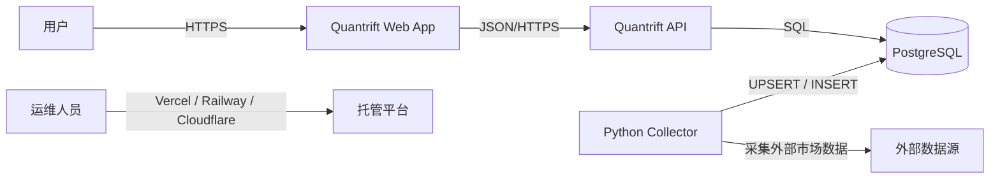
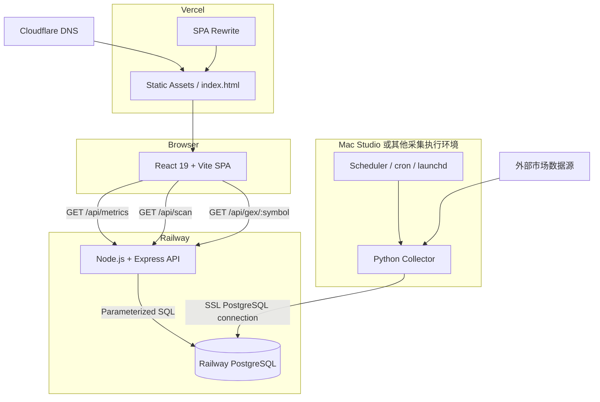
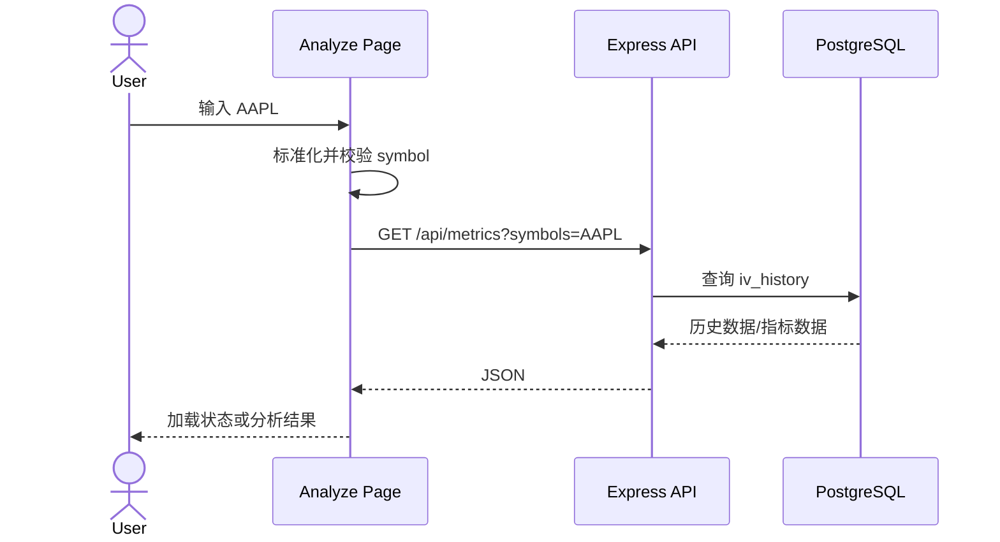
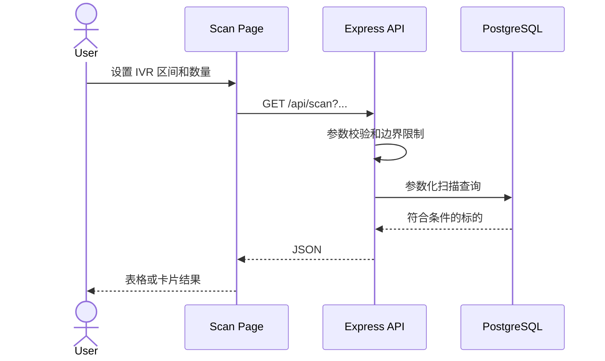
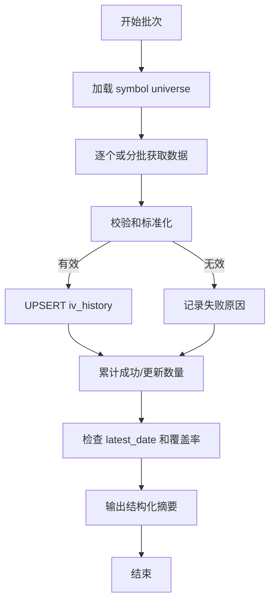

# Quantrift Options Lab 架构说明

> 项目：`whicter/quantrift_options-lab`  
> 正式站点：`https://www.quantrift.io`  
> 文档范围：前端、API、PostgreSQL、Python collector 和生产基础设施

---

## 1. 系统目标

Quantrift Options Lab 是一个面向期权研究和筛选的 Web 应用。当前系统围绕隐含波动率历史数据构建，支持：

- 按 symbol 查询指标和历史数据。
- 计算或展示 IV Rank 等波动率指标。
- 按指标区间扫描标的。
- 提供学习、分析和扫描等前端页面。
- 通过独立 collector 持续采集数据并写入 PostgreSQL。

当前架构采用清晰的三层应用加离线采集器：

```text
Presentation: React + Vite
Application/API: Node.js + Express
Persistence: PostgreSQL
Ingestion: Python collector
```

当前生产环境已完成 Vercel + Railway + Railway PostgreSQL 部署。2026-07-14 验证结果：

- `https://quantrift.io` 返回 HTTP 308，并跳转至 `https://www.quantrift.io/`。
- `https://www.quantrift.io` 返回 HTTP 200。
- Railway API `/health` 返回 `{"status":"ok"}`。
- Railway API `/api/metrics?symbols=AAPL` 能读取 `public.iv_history` 并返回 AAPL 指标。
- Railway API `/api/scan?minIvr=0&maxIvr=100&limit=5` 能返回扫描结果。
- 当前验收样例数据的 `source` 为 `test`；collector 持续采集真实市场数据仍需单独确认。

## 1.1 产品数据边界

Options Lab 的目标产品能力包括 Call Wall、Put Wall、Global GEX、Local Gamma、Gamma Flip、strike-level GEX、Max Pain、PCR、IV Skew、OI concentration 和 Unusual OI delta。

这些指标依赖 option chain、open interest、volume、Greeks、IV 和 underlying price。生产系统应采用以下原则：

- 用户请求只读取 Railway API 返回的已采集/预计算快照。
- 普通用户输入 `AAPL` 时，不应同步触发本地 Mac Studio 或 IB Gateway 拉取 option chain。
- IB Gateway 可以作为 internal research adapter，用于个人研究、算法验证和字段探索。
- 公开/付费产品的默认 option chain 数据源必须是具备相应授权和再分发权利的 provider。
- GEX 计算、API response 和前端 UI 不应绑定具体 provider；应通过 provider adapter 和数据库快照隔离数据源。

建议数据流：

```text
licensed options provider / internal IB adapter
  → collector / ingestion job
  → option_chain_snapshots + gex_snapshots in PostgreSQL
  → Railway API
  → frontend
```

Phase 3D 过渡实现采用 IB Gateway internal adapter，但只用于内部闭环验证：

```text
Mac Studio IB Gateway
  → ib_option_chain_provider.py
  → option_chain_snapshots / option_contract_snapshots
  → gex_snapshots / gex_by_strike_snapshots
  → /api/gex/:symbol
  → /analyze / /scan
```

IB 过渡阶段默认范围：

| 项目 | 过渡阶段限制 |
| --- | --- |
| Symbols | `AAPL`, `SPY`, `QQQ`, `PLTR` |
| Expirations | 7-60 DTE |
| Strikes | spot ±15% 或每边最多 20 个 strikes |
| Rights | calls + puts |
| Source label | `ib_internal` |
| Public product use | 不允许作为正式授权数据源 |

Provider adapter 必须隔离在 collector 层，API 与前端只依赖数据库 snapshot。未来切换 licensed provider 时，不应改变 `/api/gex/:symbol`、`/api/chain/:symbol` 或前端数据 contract。

Licensed provider cutover status：

| Item | Current decision |
| --- | --- |
| First candidate | Massive / Polygon options snapshot API |
| Second candidate | Intrinio options APIs |
| Required contract | OPRA/options display and redistribution rights for the intended Quantrift product |
| Adapter boundary | `collector/providers/base.py::OptionChainProvider` |
| Public source labels | Licensed provider name only; never `ib_internal` / `tt_internal` for public product paths |
| Cutover proof | Side-by-side snapshots for `AAPL`, `SPY`, `QQQ`, `PLTR` with acceptable Greeks/OI/volume completeness |

不建议的生产数据流：

```text
frontend user request
  → Railway API
  → local Mac Studio IB Gateway
  → synchronous option chain fetch
  → response
```

原因：延迟、IB pacing limit、Gateway session/2FA、本地机器可用性和数据授权边界都不适合作为公开 SaaS 请求路径。

## 1.2 快照缓存与新鲜度架构

真实数据源上线后，用户输入 `AAPL` 不应直接同步请求 provider。产品体验应基于“先读缓存快照、必要时后台刷新”的模式：

```text
用户请求
  → Railway API
  → PostgreSQL 最新快照
  → 若 fresh：立即返回
  → 若 stale：返回旧快照 + enqueue refresh
  → 若 missing：返回 queued/unavailable 状态 + enqueue refresh
  → collector / worker 异步刷新 provider
```

缓存层级：

| 层级 | 作用 | 建议数据 |
| --- | --- | --- |
| PostgreSQL snapshot cache | 产品事实来源 | `option_chain_snapshots`, `gex_snapshots`, `symbol_metrics_snapshots`, `scanner_results_snapshots` |
| API memory cache | 降低重复请求和 DB 压力 | metrics 30-60s, GEX 30-120s, scanner 1-5min |
| Frontend stale-while-revalidate | 保持页面稳定，不因刷新清空内容 | 保留上一份结果，后台刷新，显示 freshness 状态 |

Phase 3C implemented path：

```text
collector jobs
  → iv_history / price_history / option_chain_snapshots / gex_snapshots
  → collector/materialize_scan.py
  → scanner_results_snapshots
  → /api/scan reads latest materialized batch only
```

`/api/scan` must not rebuild the full watchlist from raw IV/GEX tables during a user request. If the materialized scanner batch is missing or stale, the API creates/reuses a `provider_fetch_jobs` row with `job_type=scanner_materialize`.

The current 67-symbol watchlist is a transitional Phase 3 data pool for controlled ingestion and verification. It is not the intended product boundary. The production scanner should use a broader universe table/materialized view with filters such as market cap, underlying price, dollar volume, optionable status, option-chain liquidity, sector/category and earnings window, while preserving the same snapshot-first request model.

Contract-level advanced filters are supported from stored snapshots only. `/api/scan` may filter for existence of at least one latest `option_contract_snapshots` row matching DTE, absolute Delta, bid/ask spread percentage, per-contract OI and per-contract volume. It must not fetch option chains synchronously during the request.

API response 应统一携带数据状态：

```json
{
  "symbol": "AAPL",
  "snapshot_ts": "2026-07-14T20:30:00.000Z",
  "source": "licensed_options_provider",
  "freshness": "fresh",
  "is_stale": false,
  "refresh_status": "none"
}
```

状态定义：

| 字段 | 可选值 | 含义 |
| --- | --- | --- |
| `freshness` | `fresh`, `stale`, `missing`, `unavailable` | 当前返回数据的新鲜度和可用性 |
| `refresh_status` | `none`, `queued`, `refreshing`, `failed` | 后台刷新任务状态 |

不同数据的刷新频率应分开定义：

| 数据类型 | 建议刷新频率 | 说明 |
| --- | --- | --- |
| IV Rank / IV30 / HV | 每日或收盘后 | 当前 Phase 3B 的主数据 |
| Earnings | 每日 | 低频元数据 |
| Option chain quote / IV / Greeks | 1-5 分钟 | 需要授权 provider；不应每次用户请求现拉 |
| Open interest | 每日或 provider 更新后 | 多数数据源非实时 |
| GEX / Walls / Gamma Flip | option chain 刷新后重新计算，1-5 分钟级 | 由快照派生 |
| Scanner results | 1-5 分钟预计算 | 不在用户请求时全市场扫描 |
| Weekly recap | 每日/每周 | 可离线生成 |

刷新请求需要 rate limit 和 budget：

- 单个 symbol refresh 至少间隔 60 秒。
- 同一用户的手动刷新需要限频。
- 全局 provider request budget 需要独立记录，避免超出供应商限制。
- `provider_fetch_jobs` 应记录 symbol、job type、status、attempts、last_error、created_at、started_at、finished_at。
- Phase 3C has the enqueue side, worker side, and provider budget accounting:
  - API creates/reuses `provider_fetch_jobs`.
  - `collector/run_refresh_worker.py` consumes queued jobs.
  - `provider_request_usage` tracks daily provider/job request counts against a configured budget.
  - `/api/status/cache` reports backlog, failures, stale scanner age, empty snapshots and budget usage.

---

## 2. 架构原则

### 2.1 当前原则

1. **前后端分离**  
   浏览器只访问静态前端和 HTTP API，不直接连接数据库。

2. **数据库是生产数据的单一事实源**  
   `public.iv_history` 是当前 API 使用的核心业务表。

3. **采集与查询解耦**  
   collector 负责外部数据获取和写入，API 负责只读查询和响应。

4. **平台托管优先**  
   前端使用 Vercel，API 和 PostgreSQL 使用 Railway，减少自建基础设施。

5. **单体优先，避免过早拆分**  
   当前业务规模适合一个 Express API 服务，不需要微服务。

6. **环境配置外置**  
   域名、数据库和 CORS 通过环境变量配置，不应硬编码 Secret。

### 2.2 建议补充的原则

- 所有采集写入应幂等。
- 所有 API 输入必须在服务端校验。
- schema 变更必须通过 migration。
- 关键路径应可观测。
- 架构文档区分“当前实现”和“建议演进”。

---

## 3. 系统上下文



主要参与者：

| 参与者 | 目标 |
|---|---|
| 用户 | 学习、查询 symbol、查看指标、执行扫描 |
| collector | 获取并持久化最新隐含波动率数据 |
| API | 验证请求、查询数据库、返回 JSON |
| 前端 | 提供交互、路由、输入和结果展示 |
| 运维人员 | 部署、监控、备份和故障处理 |

---

## 4. 容器级架构



---

## 5. 仓库边界

```text
quantrift_options-lab/
├── frontend/
│   ├── src/
│   ├── package.json
│   ├── vite.config.*
│   └── vercel.json
├── server/
│   ├── src/
│   │   ├── index.js
│   │   └── db.js
│   └── package.json
├── collector/
│   ├── *.py
│   └── .env.example
└── docs/
    ├── ARCHITECTURE.md
    └── QUANTRIFT_DEPLOYMENT.md
```

已确认的代码入口和配置：

- 后端生产入口：`server/src/index.js`
- 后端数据库配置：`server/src/db.js`
- 前端部署 rewrite：`frontend/vercel.json`
- API 生产启动：`npm start`
- 当前业务表：`public.iv_history`

仓库中的实际文件可能比上述示意更多。新增模块时应保持职责边界，而不是把路由、SQL、计算和响应格式全部继续堆入 `index.js`。

---

## 6. 前端架构

### 6.1 技术栈

```text
React 19
Vite
React Router
Browser Fetch / HTTP client
Vercel static hosting
```

### 6.2 页面职责

已知路由：

| 路由 | 主要职责 |
|---|---|
| `/learn` | 学习和概念内容 |
| `/analyze` | 输入 symbol 并展示指标 |
| `/scan` | 按 IV Rank 等条件筛选标的 |

建议路由层只负责页面编排，将可复用能力拆为：

```text
src/
├── pages/
├── components/
├── services/
│   └── api.*
├── hooks/
├── utils/
└── types/          # 如使用 TypeScript
```

### 6.3 API Base URL

```env
VITE_API_BASE_URL=https://quantriftoptions-lab-production.up.railway.app
```

前端不应：

- 包含数据库连接信息。
- 在浏览器中持有后端 Secret。
- 直接拼接未编码的用户输入。
- 把 Railway URL 是否可见当作安全边界。

### 6.4 前端数据流

Analyze：



Scan：



### 6.5 UI 状态

每个数据页面至少应区分：

```text
idle
loading
success
empty
error
```

不要把空数组、网络错误和无匹配结果显示成同一种状态。

### 6.6 前端错误边界

建议：

- 页面级错误提示。
- 请求 AbortController 或超时。
- 对非 2xx 响应读取统一错误结构。
- React Error Boundary 捕获渲染错误。
- 生产环境接入前端错误监控。
- 不向用户显示后端堆栈。

---

## 7. API 架构

### 7.1 技术栈

```text
Node.js
Express
pg
CORS middleware
Railway
```

### 7.2 当前接口

| Method | Path | 职责 |
|---|---|---|
| GET | `/health` | 服务存活检查 |
| GET | `/api/metrics` | 查询一个或多个 symbol 的指标 |
| GET | `/api/scan` | 按 IV Rank 等条件扫描 |
| GET | `/api/status/data` | 查询 watchlist 数据覆盖率、缺失标的、stale 标的和 latest_date |

### 7.3 建议分层

当前入口为 `server/src/index.js`。随着功能增长，建议演进为：

```text
server/src/
├── index.js              # 进程启动
├── app.js                # Express app 构建
├── config/
│   └── env.js
├── db/
│   ├── pool.js
│   └── queries/
├── routes/
│   ├── health.js
│   ├── metrics.js
│   └── scan.js
├── controllers/
├── services/
├── validators/
├── middleware/
│   ├── errors.js
│   ├── requestId.js
│   └── rateLimit.js
└── utils/
```

职责：

```text
route
  → validator
  → controller
  → service
  → repository/query
  → PostgreSQL
```

对于当前小规模项目，可以逐步拆分，不必一次性引入复杂框架。

### 7.4 参数校验

`/api/metrics`：

- `symbols` 必填。
- 去除空白并统一大写。
- 限制 symbol 数量。
- 限制单个 symbol 长度。
- 仅允许预期字符集合。
- 拒绝空 symbol。

`/api/scan`：

- `minIvr` 和 `maxIvr` 为有限数字。
- 推荐范围为 0–100。
- `minIvr <= maxIvr`。
- `limit` 为正整数。
- 服务端设置最大 `limit`。
- 对未知参数可以忽略或明确拒绝，但行为需一致。

### 7.5 SQL 安全

必须使用参数化 SQL：

```js
await pool.query(
  'SELECT * FROM public.iv_history WHERE symbol = $1 ORDER BY date DESC',
  [symbol]
);
```

不得：

```js
const sql = `SELECT * FROM iv_history WHERE symbol = '${symbol}'`;
```

即使前端做过校验，后端仍必须参数化。

### 7.6 统一响应

建议成功响应：

```json
{
  "data": {},
  "meta": {
    "requestId": "..."
  }
}
```

建议错误响应：

```json
{
  "error": {
    "code": "INVALID_QUERY",
    "message": "minIvr must be between 0 and 100"
  },
  "meta": {
    "requestId": "..."
  }
}
```

当前接口不必立刻破坏兼容性，但新增接口应逐步统一。

### 7.7 连接池

API 使用 PostgreSQL 连接池，而不是每次请求创建全新连接。

建议配置：

- 连接超时。
- 查询超时。
- 合理 `max` 连接数。
- 监听 pool error。
- Railway 关停时优雅关闭连接池。

### 7.8 Health、Readiness 和 Liveness

当前：

```text
GET /health
```

建议未来区分：

| Endpoint | 作用 |
|---|---|
| `/health` 或 `/live` | 进程是否存活 |
| `/ready` | API 是否能够服务，包括数据库连接 |
| `/version` | 可选，返回 commit/version，不含 Secret |

---

## 8. 数据层架构

### 8.1 核心表

```text
public.iv_history
```

语义上，该表保存按 symbol 和交易日期组织的隐含波动率历史及相关字段。

60 天 OHLCV 存入：

```text
public.price_history
```

该表用于趋势图、RVol、weekly recap 和后续技术指标。数据由 `collector/collect_prices.py` 每天按 watchlist upsert 最近 60 个交易日，API 只读查询最近窗口。不要把 OHLCV 长期放在前端 mock、浏览器缓存或本地 CSV 中。

当前状态：

- `server/src/migrate.js` 已包含 `price_history` 建表和索引。
- 2026-07-14 已在 Railway PostgreSQL 创建 `public.price_history`。
- `collector/collect_prices.py` 已实现 provider adapter：默认 `PRICE_PROVIDER=ib_internal`，显式开发/回填可用 `PRICE_PROVIDER=stooq`。
- `server/src/routes/prices.js` 暴露 `GET /api/prices/:symbol?limit=60`。
- 前端 `/analyze` Tab2 和 `/weekly` Sec1 会优先使用 `price_history`，没有价格历史时保留清晰 fallback/提示。
- yfinance 不作为默认路径；后续如接入订阅价格源，应新增 provider adapter，不改变前端 API contract。

具体列定义必须以生产数据库和 migration 为准；在 schema 未纳入代码前，不应仅凭文档猜测字段。

### 8.2 建议数据不变量

以下约束适合 IV 历史表，但实施前需与实际数据源验证：

- `symbol` 非空。
- `date` 非空。
- 同一 `symbol + date` 不重复。
- IV 数值为有限非负值。
- 派生字段能够由原始字段和历史窗口重算。
- 采集时间与市场数据日期分开记录。
- 可识别数据来源或 collector 版本。

建议：

```text
UNIQUE(symbol, date)
INDEX(symbol, date DESC)
INDEX(date DESC)
```

### 8.3 IV Rank 语义

常见定义：

\[
\mathrm{IVRank}
=
\frac{\mathrm{IV}_{current}-\mathrm{IV}_{min}}
{\mathrm{IV}_{max}-\mathrm{IV}_{min}}
\times 100
\]

其中窗口常设为约一年交易日，但项目应明确：

- 使用多少个交易日。
- 使用哪一种 IV。
- 当前值对应哪个时间点。
- 窗口不足时如何处理。
- 当最大值等于最小值时如何处理。
- 是否在 SQL、API 或 collector 中计算。

避免不同页面或接口采用不同口径。

### 8.4 派生指标放在哪里

可选方案：

| 位置 | 优点 | 缺点 |
|---|---|---|
| 查询时 SQL 计算 | 单一数据源，实时 | 大扫描可能昂贵 |
| API 服务计算 | 易测试和演进 | 传输数据较多 |
| collector 预计算 | 查询最快 | 口径升级需回填 |
| Materialized View | 查询快、逻辑集中 | 需刷新机制 |

当前规模可继续查询时计算；若 `/api/scan` 延迟显著，再考虑预计算或 materialized view。

### 8.5 Migration

建议：

```text
server/migrations/
├── 001_create_iv_history.sql
├── 002_add_iv_history_indexes.sql
└── ...
```

migration 是 schema 的事实源，文档只解释设计。

---

## 9. Collector 架构

### 9.1 职责

collector 负责：

1. 从外部数据源获取期权或隐含波动率数据。
2. 标准化 symbol、日期和数值。
3. 校验完整性。
4. 计算必要派生字段，若该职责由 collector 承担。
5. 幂等写入 PostgreSQL。
6. 记录运行结果。
7. 暴露失败和数据新鲜度信号。

### 9.2 推荐执行流程



### 9.3 幂等写入

建议使用：

```sql
INSERT INTO public.iv_history (...)
VALUES (...)
ON CONFLICT (symbol, date)
DO UPDATE SET ...;
```

更新策略要明确：

- 数据源修订时是否覆盖。
- 哪些字段允许更新。
- 是否记录 `updated_at`。
- 如何防止空值覆盖已有有效值。

### 9.4 失败隔离

collector 不应因单个 symbol 失败而完全丢失整个批次。建议：

- 对外部请求有限次数重试。
- 指数退避。
- 连接和读取超时。
- 单 symbol 错误记录。
- 最终汇总失败列表。
- 失败比例超过阈值时触发告警。
- 数据库事务粒度避免整个 universe 一次性大事务。

### 9.5 调度

当前可由 Mac Studio 执行。调度可选：

- `launchd`
- `cron`
- `systemd`（Linux）
- Railway Cron/Job
- GitHub Actions schedule（仅在数据源、Secret 和运行时适合时）

当前不要为了“云化”而迁移；先保证：

- 机器断电恢复后任务能继续。
- 网络失败可恢复。
- 日志可查看。
- 运行状态可告警。
- Secret 安全存放。

---

## 10. 端到端数据流

### 10.1 写路径

```text
外部数据源
    ↓
Python collector
    ↓  标准化 / 校验 / 派生
PostgreSQL public.iv_history
```

### 10.2 读路径

```text
用户
    ↓
React 页面
    ↓ HTTPS
Express API
    ↓ 参数化 SQL
PostgreSQL
    ↓
JSON
    ↓
React 页面展示
```

### 10.3 部署路径

```text
GitHub master
    ├── frontend/ 变更 → Vercel Build → Vercel Production
    └── server/ 变更   → Railway Build → Railway API

collector 更新
    └── 单独部署或同步到 Mac Studio 执行环境
```

---

## 11. 基础设施架构

### 11.1 Cloudflare

职责：

- 域名注册或 DNS 管理。
- 将 `@` 和 `www` 指向 Vercel。
- 当前不代理主站流量。

### 11.2 Vercel

职责：

- 构建 Vite。
- 托管静态资源。
- TLS。
- CDN。
- SPA rewrite。
- Production/Preview 部署。

### 11.3 Railway API

职责：

- 构建和运行 Express。
- 注入 `PORT`。
- 管理 API 环境变量。
- 提供公网 HTTPS 域名。
- 健康检查和日志。

### 11.4 Railway PostgreSQL

职责：

- 持久化 `iv_history`。
- 为 Railway API 提供私有网络连接。
- 为本地 collector 提供受保护的公网 TCP 连接。
- 提供平台级存储、指标和可选备份能力。

---

## 12. 环境边界

| 环境 | 前端 | API | 数据库 |
|---|---|---|---|
| Local full stack | localhost:5173 | localhost:3001 | Railway 公网 DB 或本地 DB |
| Local frontend only | localhost:5173 | Railway API | Railway DB，仅临时调试 |
| Vercel Preview | Preview URL | 明确配置的 API | 对应 DB |
| Production | www.quantrift.io | Railway Production | Railway Production DB |

风险：

- Preview 不应无意间写生产数据。
- 本地 UI preview 默认应调用本地 backend；直接调用 Railway production API 只作为临时调试路径。
- collector 测试不应污染生产 `iv_history`。
- 若只有一个数据库，应把所有 API 保持只读，并谨慎运行 collector。
- 长期建议增加 staging 数据库或至少独立 schema。

---

## 13. 安全架构

### 13.1 信任边界

```text
不可信：
- 浏览器输入
- URL query parameters
- 外部数据源响应
- 公网 API 请求

可信但需最小权限：
- Railway API runtime
- collector runtime
- PostgreSQL credentials
- Vercel/Railway deployment integration
```

### 13.2 必要控制

- 后端参数校验。
- 参数化 SQL。
- CORS allowlist。
- API rate limit。
- 响应大小限制。
- 查询 timeout。
- 数据库连接池限制。
- Secret 不进入前端。
- 日志脱敏。
- 依赖漏洞扫描。
- 平台账户 MFA。
- GitHub branch protection，按项目成熟度逐步启用。

### 13.3 数据库权限

长期建议区分：

```text
quantrift_api
- SELECT iv_history

quantrift_collector
- SELECT/INSERT/UPDATE iv_history

quantrift_migration
- DDL 权限，仅用于 migration
```

当前若统一使用高权限账户，应视为技术债。

---

## 14. 性能架构

### 14.1 当前瓶颈候选

- `/api/scan` 对整个历史表重复聚合。
- 缺少 `symbol/date` 索引。
- 每个 symbol 多次独立查询。
- API 返回过量历史数据。
- Railway 连接数或资源限制。
- 前端重复请求。
- collector 与扫描同时进行导致数据库竞争。

### 14.2 优化顺序

1. 记录真实查询延迟。
2. 使用 `EXPLAIN (ANALYZE, BUFFERS)`。
3. 增加正确索引。
4. 减少返回字段和行数。
5. 合并 N+1 查询。
6. 在 API 层做短期缓存。
7. 必要时增加预计算表或 materialized view。
8. 最后再考虑 Redis 或服务拆分。

不要在没有数据的情况下先引入缓存基础设施。

---

## 15. 可靠性架构

### 15.1 主要故障模式

| 故障 | 用户影响 | 检测 |
|---|---|---|
| Vercel 构建失败 | 新版本不上线 | Vercel deploy status |
| SPA rewrite 丢失 | 深层路由刷新 404 | 路由 smoke test |
| Railway API 挂掉 | Analyze/Scan 不可用 | `/health` |
| PostgreSQL 不可用 | API 500 | readiness/DB error |
| collector 未运行 | 数据陈旧 | `MAX(date)` |
| collector 部分失败 | 标的覆盖下降 | symbol count/失败率 |
| CORS 配错 | 浏览器请求失败 | DevTools/自动化请求 |
| schema 漂移 | 查询失败 | migration/version check |

### 15.2 恢复目标

当前项目可以采用轻量目标，后续明确：

- RTO：服务故障后允许多长时间恢复。
- RPO：最多允许丢失多少采集数据。
- 数据能否从外部源重新回填。
- PostgreSQL 恢复是否经过演练。

### 15.3 降级策略

- `/learn` 应尽量不依赖 API。
- Analyze 请求失败时显示明确错误，不显示错误数据。
- Scan 超时时返回可理解的错误。
- 不应在数据库错误时静默返回空数组。
- collector 数据陈旧时，前端可显示“数据截至日期”。

---

## 16. 可观测性架构

### 16.1 API

记录：

```text
timestamp
level
requestId
method
path
status
durationMs
errorCode
```

避免记录：

```text
DATABASE_URL
password
Authorization token
完整堆栈直接返回用户
```

### 16.2 Collector

记录：

```text
runId
startedAt
finishedAt
source
symbolsRequested
symbolsSucceeded
symbolsFailed
rowsInserted
rowsUpdated
latestDataDate
```

### 16.3 数据质量

建议指标：

```text
latest_date
distinct_symbol_count
rows_per_date
duplicate symbol/date count
null critical field count
collector failure ratio
```

### 16.4 告警

最有价值的第一批告警：

1. API `/health` 连续失败。
2. HTTP 5xx 突增。
3. collector 运行失败。
4. `latest_date` 落后于预期交易日。
5. symbol coverage 显著下降。
6. PostgreSQL 存储或连接接近上限。

---

## 17. 测试架构

### 17.1 前端

- API service 单元测试。
- 页面 loading/error/empty 状态。
- 路由直接访问测试。
- Analyze 和 Scan 的核心交互测试。

### 17.2 API

- 参数校验。
- metrics 成功/空结果/非法 symbol。
- scan 边界值。
- 数据库异常映射。
- SQL 注入输入。
- CORS。
- 最大 limit。

### 17.3 Collector

- 外部响应解析。
- 缺失字段。
- 非法数值。
- 重试。
- 幂等写入。
- 部分失败。
- 数据日期和时区。

### 17.4 端到端

最小 smoke tests：

```text
GET /
GET /learn
GET /analyze
GET /scan
GET /health
GET /api/metrics?symbols=AAPL
GET /api/scan?minIvr=0&maxIvr=100&limit=5
```

---

## 18. 架构决策记录

建议在：

```text
docs/adr/
```

保存重要决策。

首批 ADR：

```text
0001-use-vercel-for-frontend.md
0002-use-railway-for-api-and-postgres.md
0003-keep-collector-separate-from-query-api.md
0004-use-www-as-canonical-domain.md
0005-use-postgresql-as-system-of-record.md
```

ADR 应写明：

- 背景。
- 决策。
- 替代方案。
- 影响。
- 状态。

---

## 19. 当前技术债

按优先级：

### P0：数据可信度

- 确认 collector 持续运行。
- 增加数据新鲜度检查。
- 明确 IV Rank 计算口径。
- 防止 symbol/date 重复。

### P1：可恢复性

- 将 schema 纳入 migration。
- 明确备份策略。
- 执行一次恢复演练。
- 保存 collector 运行摘要。

### P1：API 防护

- 完整参数校验。
- 服务端最大 limit。
- rate limit。
- 查询 timeout。
- 统一错误处理。

### P2：代码可维护性

- 从 `index.js` 拆出 routes、services 和 queries。
- 集中环境变量校验。
- 增加自动测试。
- 统一 API 响应结构。

### P2：可观测性

- 结构化日志。
- request ID。
- Sentry 或同类错误监控。
- 数据质量 dashboard。

---

## 20. 演进路线

### 阶段 1：稳定当前单体

```text
React SPA
Express API
PostgreSQL
Mac Studio collector
```

完成：

- migration。
- backup。
- health/readiness。
- 数据新鲜度告警。
- 参数校验。
- 索引和慢查询分析。

### 阶段 2：提升数据管道

当 symbol 数量或采集频率增长时：

- collector 批处理。
- 任务锁，防止并发重复运行。
- run history 表。
- failed symbol 重试队列。
- 数据质量规则。
- staging table + transaction merge。

### 阶段 3：提升查询性能

仅在真实负载需要时：

- latest metrics 表。
- materialized view。
- 短期 API cache。
- 分页。
- 按 symbol/date 分区，只有表规模足够大时考虑。

### 阶段 4：用户和产品能力

需要用户账户时：

- 身份认证。
- Watchlist。
- Saved scan。
- 权限模型。
- 审计记录。
- 用户数据与市场数据分离。

### 不建议现在做

- Kubernetes。
- 多微服务。
- Kafka。
- 服务网格。
- 多区域数据库。
- 复杂事件驱动架构。

---

## 21. 架构验收标准

当前架构可视为健康，需要满足：

- `www.quantrift.io` 稳定访问。
- 根域名正确跳转。
- 三个 SPA 路由可刷新。
- `/health` 成功。
- `/api/metrics` 和 `/api/scan` 返回有效响应。
- API 不接受明显非法参数。
- SQL 参数化。
- `iv_history` 最新日期符合预期。
- collector 失败可被发现。
- Secret 未提交到 Git。
- schema 可以通过 migration 重建。
- 数据可以从备份恢复。
- 生产错误可定位到具体请求或 collector run。

---

## 22. 关键接口与依赖总结

| 组件 | 输入 | 输出 | 关键依赖 |
|---|---|---|---|
| React SPA | 用户操作、API JSON | 页面 | Vercel、API URL |
| Express API | HTTP query | JSON | PostgreSQL、环境变量 |
| PostgreSQL | SQL 读写 | 持久化数据 | Railway storage |
| Python collector | 外部数据 | `iv_history` rows | 外部数据源、DB |
| Cloudflare | DNS 查询 | Vercel 解析 | DNS 配置 |
| Vercel | Git commit | 静态部署 | GitHub、Node build |
| Railway API | Git commit | Express runtime | GitHub、env、Postgres |

---

## 23. 当前架构快照（Phase 3C complete）

当前已完成的运行路径：

| Path | Current implementation |
|---|---|
| IV metrics | `collect.py` → `iv_history` → `/api/metrics` |
| Price history | `collect_prices.py` → `price_history` → `/api/prices/:symbol` |
| Option chain | `collect_options.py` → `option_chain_snapshots` / `option_contract_snapshots` |
| GEX / Walls | `compute_gex.py` → `gex_snapshots` / `gex_by_strike_snapshots` |
| Scanner cache | `materialize_scan.py` → `scanner_results_snapshots` → `/api/scan` |
| OI delta / unusual | `materialize_oi_delta.py` → `option_oi_delta_snapshots` → `/api/unusual/:symbol` |
| Refresh queue | API enqueue → `provider_fetch_jobs` → `run_refresh_worker.py` |
| Budget / monitoring | `provider_request_usage` + `/api/status/cache` |

3C runtime verification performed on 2026-07-14:

- Migration completed against Railway PostgreSQL.
- `materialize_scan.py` wrote 67 scanner rows for `scan_key=watchlist_v1`.
- `run_refresh_worker.py` completed with no queued jobs.
- Local API with Railway DB returned `/api/scan?minIvr=0&maxIvr=100&limit=3` from materialized scanner rows.
- `/api/status/cache` returned scanner row_count=67 and stale=false.
- `/api/metrics?symbols=PLTR` returned freshness metadata.
- Phase 3E verification：`materialize_oi_delta.py` wrote 10 PLTR OI delta rows; `/api/unusual/PLTR` returned confirmed rows with `oi_delta=0` and `status=quiet`.
- Scanner materialization derives trend fields from `price_history` (`trend_score`, `trend_label`, `trend_signal`, 5D change, RSI14, MA20/50/200) and carries `earnings_date` from `iv_history`; the frontend does not compute scanner-wide trend on demand.

Known current monitoring state:

- `/api/status/cache` may report `degraded` while historical failed IB jobs or metadata-only option snapshots remain in the 24h window.
- This is expected monitoring visibility, not a Phase 3C implementation failure.
- 2026-07-15 collector audit found uneven coverage: `iv_history` and `price_history` covered the watchlist, while option-chain/GEX snapshots initially covered only PLTR. The option collector now defaults to `watchlist.txt`, and targeted backfills remain available through `OPTION_SYMBOLS` / `SYMBOLS`.
- Refresh worker failure handling now has four guardrails: stale `running` jobs are recovered after timeout, unsupported provider names fail closed instead of requeueing forever, TT auth failures are catchable so worker state is written back to `provider_fetch_jobs`, and option-chain jobs fall back from `tt_internal` to `ib_internal` when TT auth is unavailable.
- API refresh enqueue rejects malformed ticker symbols before insertion. `__SCAN__` remains an internal sentinel only for `scanner_materialize`.
- Analyze ticker entry handles IME composition explicitly and rejects malformed ticker artifacts before API calls.
- Current verified complete option/GEX DB coverage after recovery: PLTR, QQQ and KLAC. STX and TSLA have IB option-chain snapshots, but those snapshots are partial with no bid/ask, Greeks or OI, so GEX/Wall remains unavailable by design.

## 24. 最终架构概览

```text
                        ┌─────────────────────────────┐
                        │       Cloudflare DNS        │
                        │ quantrift.io / www           │
                        └──────────────┬──────────────┘
                                       │
                                       v
                        ┌─────────────────────────────┐
                        │            Vercel           │
                        │ React 19 + Vite + Router     │
                        └──────────────┬──────────────┘
                                       │ HTTPS JSON
                                       v
                        ┌─────────────────────────────┐
                        │        Railway Express       │
                        │ health / metrics / prices    │
                        │ chain / gex / scan / status  │
                        └──────────────┬──────────────┘
                                       │ SQL
                                       v
                        ┌─────────────────────────────┐
                        │     Railway PostgreSQL       │
                        │ iv / price / option / gex    │
                        │ scanner / jobs / usage       │
                        └──────────────┬──────────────┘
                                       ^
                                       │ UPSERT + materialize + jobs
                        ┌──────────────┴──────────────┐
                        │ Python Collector / Worker    │
                        │ collect / compute / refresh  │
                        └──────────────┬──────────────┘
                                       │
                                       v
                        ┌─────────────────────────────┐
                        │ Market Data Providers        │
                        │ TT / IB internal / licensed  │
                        └─────────────────────────────┘
```

该架构适合当前项目阶段。近期工作的重点不是拆分服务，而是接入授权 options provider、补齐 unusual/OI delta 数据层，并把 scanner/analyze 从 positioning context 推进到 contract-level strategy selection。
